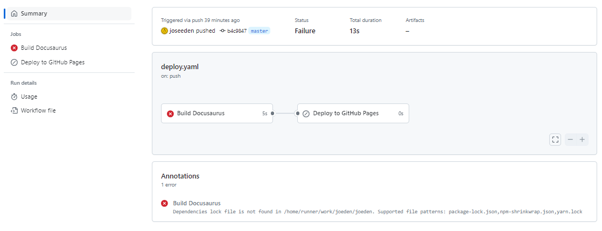
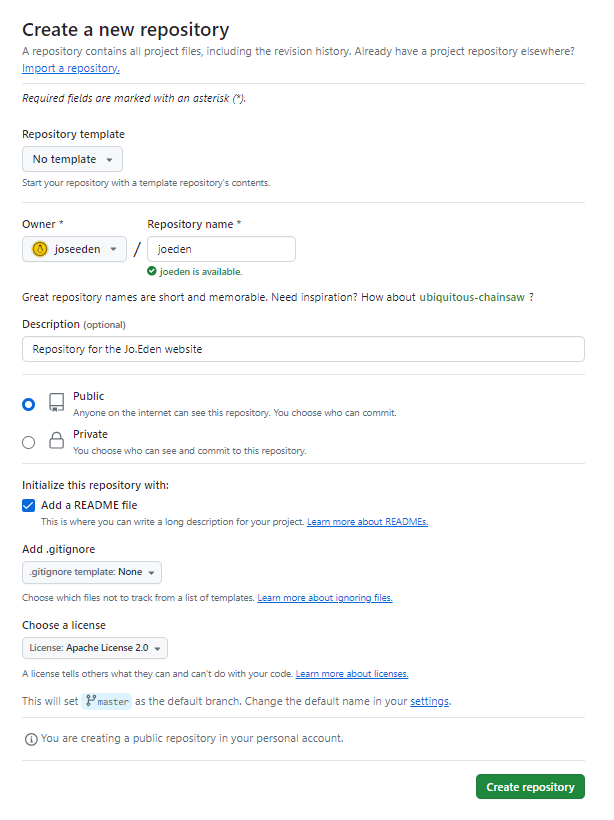
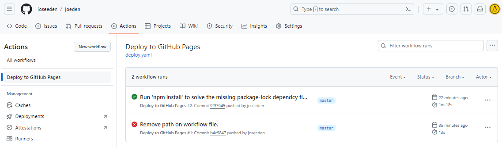

# Building a Documentation Website


## Prerequisites 

- [Install NodeJS and NPX](./005-Tools-Specifications.md#nodejs)


## Docusaurus

### Create your Docusaurus site

Make sure NodeJS and NPX is already install. Run the command below and specify the name of your site.

```bash
# joeden is the name of my site.
npx create-docusaurus@latest joeden classic 
```

To check the Docusaurus version, run the command below in the root of the project directory.

```bash
npm list @docusaurus/core 
```

It should return:

```bash
├── @docusaurus/core@3.4.0
└─┬ @docusaurus/preset-classic@3.4.0
  ├── @docusaurus/core@3.4.0 deduped
  ├─┬ @docusaurus/plugin-content-blog@3.4.0
  │ └── @docusaurus/core@3.4.0 deduped
  ├─┬ @docusaurus/plugin-content-docs@3.4.0
  │ └── @docusaurus/core@3.4.0 deduped
  ├─┬ @docusaurus/plugin-content-pages@3.4.0
  │ └── @docusaurus/core@3.4.0 deduped
  ├─┬ @docusaurus/plugin-debug@3.4.0
  │ └── @docusaurus/core@3.4.0 deduped
  ├─┬ @docusaurus/plugin-google-analytics@3.4.0
  │ └── @docusaurus/core@3.4.0 deduped
  ├─┬ @docusaurus/plugin-google-gtag@3.4.0
  │ └── @docusaurus/core@3.4.0 deduped
  ├─┬ @docusaurus/plugin-google-tag-manager@3.4.0
  │ └── @docusaurus/core@3.4.0 deduped
  ├─┬ @docusaurus/plugin-sitemap@3.4.0
  │ └── @docusaurus/core@3.4.0 deduped
  ├─┬ @docusaurus/theme-classic@3.4.0
  │ └── @docusaurus/core@3.4.0 deduped
  └─┬ @docusaurus/theme-search-algolia@3.4.0
    └── @docusaurus/core@3.4.0 deduped 
```

### Start Development Server 

Start your site. 

```bash
cd joeden
npx docusaurus start 
```

You can also use the command:

```bash
npm start 
```

By default, a browser window will open at http://localhost:3000.


### Sidebars


## Troubleshooting 

### Testing route 

To test if the routes are in place and that landing page is loading correctly, we can use the following config for the src/pages/index.tsx.

```bash
import React from 'react';

const HomePage = () => {
  return <div>Welcome to the homepage!</div>;
};

export default HomePage;
```

### ESLint

In some instances, you may need to install several ESLint-related packages to ensure everything works correctly. Here's a list of the packages you need to install and the command to install them using npm or yarn

Package                             | Description                                                   | 
------------------------------------|---------------------------------------------------------------|
 eslint                             | The core ESLint package.                                      | 
 @typescript-eslint/parser          | Parses TypeScript code so ESLint can understand it.           | 
 @typescript-eslint/eslint-plugin   | A plugin that contains rules for TypeScript code.             | 
 eslint-config-prettier             | Disables ESLint rules that might conflict with Prettier.      | 
 eslint-plugin-prettier             | (optional but recommended): Runs Prettier as an ESLint rule.  | 


Install using npm.

```bash
npm install --save-dev eslint @typescript-eslint/parser @typescript-eslint/eslint-plugin eslint-config-prettier eslint-plugin-prettier
```

Install using yarn.

```bash
yarn add --dev eslint @typescript-eslint/parser @typescript-eslint/eslint-plugin eslint-config-prettier eslint-plugin-prettier
```

**Sample script**

You can also want to add some scripts to your `package.json` to easily run ESLint:

```json
{
  "scripts": {
    "lint": "eslint . --ext .js,.ts,.tsx",
    "lint:fix": "eslint . --ext .js,.ts,.tsx --fix"
  }
}
```

After installing the packages, you can run ESLint on your project:

- To check for linting issues:
  ```bash
  npm run lint
  ```
  or
  ```bash
  yarn lint
  ```

- To automatically fix linting issues:
  ```bash
  npm run lint:fix
  ```
  or
  ```bash
  yarn lint:fix
  ```

### Dependencies lock file is not found 

If your Github action deployment failed and you got this error:

```bash
Dependencies lock file is not found...
```



Try running install command. This will create the package-lock.json.

```bash
npm install 
```

## Deploy 

### Github Pages via Github Actions

Create the repository first:




Going back to your local repository, initialize it as a Github repository.
Set the remote Github repository as the upstream repository. Commit and push.

```bash
git init 
git add . 
git commit -m "first commit"
git remote add origin https://github.com/joseeden/joeden.git 
git push -u origin master               
```

Next, modify the docusaurus.config.js.

```js
  title: 'JOEDEN',
  tagline: 'Engineer by day, Runner by night.',
  favicon: 'img/favicon.ico',
  url: 'https://github.com',
  baseUrl: '/joeden/',

  // GitHub pages deployment config.
  organizationName: 'joseeden',          // Usually your GitHub org/user name.
  projectName: 'joeden',                 // Usually your repo name.
  deploymentBranch: "master",            // Change to the branch used 
  onBrokenLinks: 'throw',
  onBrokenMarkdownLinks: 'warn', 
```

Create the workflow file. I'm using npm here, so you're configuration may change if you're using yarn.

| If you're using npm             | If you're using yarn  |
|---------------------------------|-----------------------|
| cache: yarn                     | cache: npm            |
| yarn install --frozen-lockfile  | npm ci                |
| yarn build                      | npm run build         |

```bash
# deploy.yaml 
name: Deploy to GitHub Pages

on:
  push:
    branches:
      - master
    # Review gh actions docs if you want to further define triggers, paths, etc
    # https://docs.github.com/en/actions/using-workflows/workflow-syntax-for-github-actions#on

jobs:
  build:
    name: Build Docusaurus
    runs-on: ubuntu-latest
    steps:
      - uses: actions/checkout@v4
        with:
          fetch-depth: 0
      - uses: actions/setup-node@v4
        with:
          node-version: 18
          cache: npm

      - name: Install dependencies
        run: npm ci
      - name: Build website
        run: npm run build

      - name: Upload Build Artifact
        uses: actions/upload-pages-artifact@v3
        with:
          path: build

  deploy:
    name: Deploy to GitHub Pages
    needs: build

    # Grant GITHUB_TOKEN the permissions required to make a Pages deployment
    permissions:
      pages: write # to deploy to Pages
      id-token: write # to verify the deployment originates from an appropriate source

    # Deploy to the github-pages environment
    environment:
      name: github-pages
      url: ${{ steps.deployment.outputs.page_url }}

    runs-on: ubuntu-latest
    steps:
      - name: Deploy to GitHub Pages
        id: deployment
        uses: actions/deploy-pages@v4

```

Commit and push.

```bash
git add; git commit 
```

In Github, check the Actions tab. We should see the workflow created.



## Resources 

### Websites

These are some of the documentation websites that I find to be beautifully created, which I'll be using as reference for my personal website.

- [Snowflake Tutorials](https://docs.snowflake.com/en/tutorials)
- [LiveKit Docs](https://docs.livekit.io/home/)
- [Ionic Docs](https://ionicframework.com/docs)
- [Developers Documentation](https://developers.atinternet-solutions.com/piano-analytics/data-collection/general/how-it-works)
- [pdfme docs](https://pdfme.com/docs/getting-started)
- [About npm](https://docs.npmjs.com/about-npm)


### Reference

- [Docusaurus](https://docusaurus.io/docs)
- [Build a Markdown Documentation Site with Docusaurus (Step-by-Step)](https://www.youtube.com/watch?v=2R53Y7eP45k)