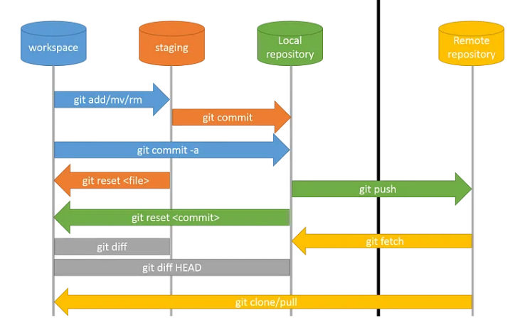

## Repositories

Every repository is its own self-contained, independent store to have source-controlled versioning.

- You can use public repositories such as Github, Bitbucket, etc
- You can have your own private repositories within your local network or private repositories which you can access over a vpn


## Initializing

To initialize a git repository, go to the folder you want to enable git
and initialize git there.

```bash
git init
```

To un-initialize a local git repo/folder:
```bash
cd </folder/repo-name>
rm -rf .git
```

## User Configuration 

After initializing your git repo, you can set your Git credentials next.

```bash
git config --global user.name "johnsmith"
git config --global user.email johnsmith@gmail.com
```

## Staging and Commiting  

**Staging** allows you to prepare changes for the next commit. You can stage specific files, directories, or all changes at once.


**Commiting** saves changes to your local repository. A commit captures the state of your project at a specific point in time.

Common commands:

- Stage changes for all files.

    ```bash
    git add .  
    ```

- Stage changes for a specific file or directory.

    ```bash
    git add /directory/files  
    ```

- Commit the change and provide the commit message inline.

    ```bash
    git commit  -m "This is the commit  message."
    ```

- Change the commit messages:

    ```bash
    git commit --amend
    ```

- Amended message can also be provided in the command:

    ```bash
    git commit --amend -m "Updated commit message"
    ```    

Here is an informative diagram that shows the difference between the commands:

<div style={{textAlign: 'center'}}>



</div>


## References

- [Introduction to Git and Github](https://www.coursera.org/learn/introduction-git-github#syllabus)
- [Collaborate with Git](https://www.cbtnuggets.com/it-training/skills/collaborate-git)
- [Git for Developers using Github](https://www.coursera.org/projects/git-for-developers-using-github)
- [Git Commands](https://github.com/joseeden/Git-Commands)


