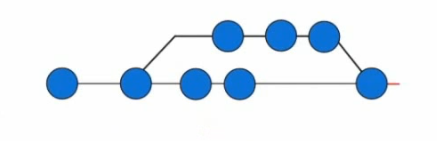
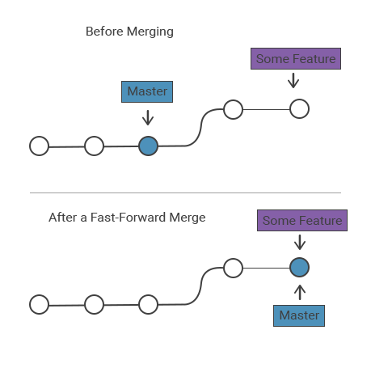
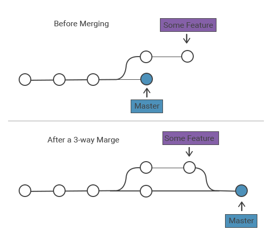

# Merging


## Merging

Merging works by combining your branches into a single timeline, thus consolidating the commit history. Think of this as the opposite of branching. While branching allows you create multiple versions and commit independent changes on those versions, merging combines all those version into one timeline.


<div style={{textAlign: 'center'}}>



</div>

There are two branches involved in every merge:
- **Target branch** - where changes are being pulled from; feature branch
- **Receiving branch** - where changes are being pulled into; current directory


## Fast-forward Merge

This is basically having a feature branch and merging your changes to the master branch which doesn't have any additional commits since the feature branch were created.

What this means is that no other changes were introduced to the master branch since feature branch were created. When it's time to merge your feature branch, you're just moving the "master tip-node" in front of the feature branch.


<div style={{textAlign: 'center'}}>



</div>


## 3-Way Merge

If you did some changes on both the feature branch and the master branch, youcant simply move the master tip-node and do a fast-forward merge because you might lose some commits.What you want is to save the commits on the feature branch and the commits on the master branch and combine them into a single commit


<div style={{textAlign: 'center'}}>



</div>


## Conflicts

While git will try to merge the changes seamlessly, there will be some conflicts that will arise sometimes. These conflicts will need to be resolved manually. If errors are encountered during merging, you can stop before anything permanent is done in the code in your current working branch

```bash
git merge --abort
```

## Common Commands

- Merge our upstream master branch with our local branch.

    ```bash
    git merge upstream/master
    ```

- Merge a branch into the active branch.

    ```bash
    git merge [branch name]	
    ```

- Merge a branch into a target branch
    
    ```bash
    git merge [source branch] [target branch]
    ```
