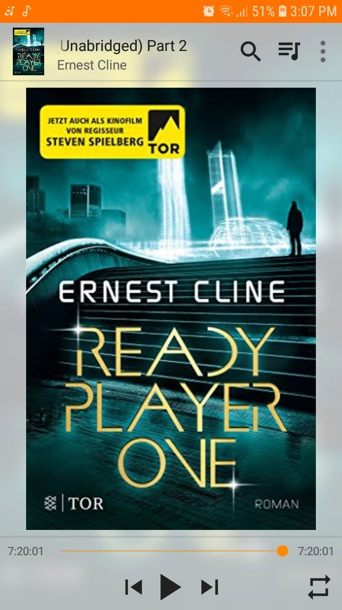

*Ready Player One*, de Ernest Cline

Libro 4 de 100

La mejor forma de describir este libro: **NOSTÁLGICO.**

Algunas partes de la historia pueden resultar un poco planas y, sinceramente, la trama principal probablemente cabría en un solo episodio de una serie de ciencia ficción.

Pero lo que la lleva a otro nivel es todo lo que la rodea.

Las referencias a los juegos de rol clásicos, los juegos de recreativas, la música, las películas, la cultura friki y los primeros años de los videojuegos le dan un encanto especial.

Parece una enorme carta de amor a una generación que creció refugiándose en mundos ficticios mucho antes de que pudiéramos imaginar la realidad virtual como algo de uso cotidiano.

Probablemente eso fue lo que me hizo disfrutarlo.

Y sí, sin duda veré también la adaptación cinematográfica, junto con los otros libros y películas que ya tengo pendientes.

Pero también hubo una idea que se me quedó después de terminarlo.

¿No estaremos avanzando poco a poco hacia algo parecido?

Cada vez más partes de nuestra vida transcurren a través de pantallas.

El trabajo.

El entretenimiento.

Las amistades.

Los juegos.

Comunidades enteras.

Construimos estos espacios digitales donde podemos ser quienes queramos, mientras el mundo real sigue funcionando en algún lugar de fondo.

Quizá todavía no vivamos dentro del OASIS.

Pero a veces parece que ya estamos practicando para ello.

Supongo que es una idea sobre la que vale la pena reflexionar.
