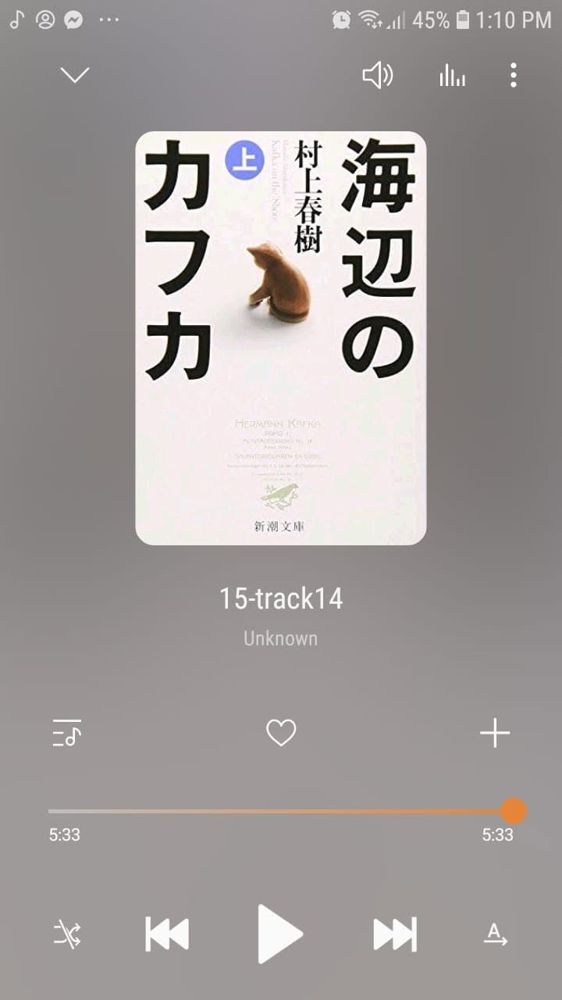

# Libro: Kafka en la orilla (海辺のカフカ. Umibe no Kafuka)

*Kafka en la orilla*, de Haruki Murakami

Libro 12 de 100

«Si tú me recuerdas, no me importa que todos los demás me olviden».

Joder. Qué final tan abierto.

Hubo tantos momentos en este libro en los que seguía esperando que todo encajara por fin, como si tuviera que existir una explicación clara que uniera todos aquellos sucesos extraños.

Y entonces Murakami básicamente dijo: pues no.

Hay sueños, recuerdos, gatos que hablan, coincidencias extrañas, metáforas que quizá sean metáforas o quizá no, y personas que entran y salen de la vida de los demás.

Luego el libro termina y te quedas ahí sentado pensando:

**Espera. ¿Eso es todo?**

Pero, por extraño que parezca, probablemente por eso se te queda dentro.

No porque todo quedara explicado, sino porque no fue así.

Hay cosas en las que sigo pensando incluso después de terminarlo, pero la que de verdad se me quedó grabada fue:

**¿Qué fue de Hoshino después de que el gato le respondiera?**

¿Cambió algo de verdad?

¿Fue solo otro encuentro extraño?

¿O era simplemente la forma de Murakami de recordarnos que no todo necesita quedar perfectamente resuelto para que la historia continúe?

Sinceramente, no lo sé.

Y quizá de eso se trata.

Algunas historias terminan.

Otras simplemente se detienen.

