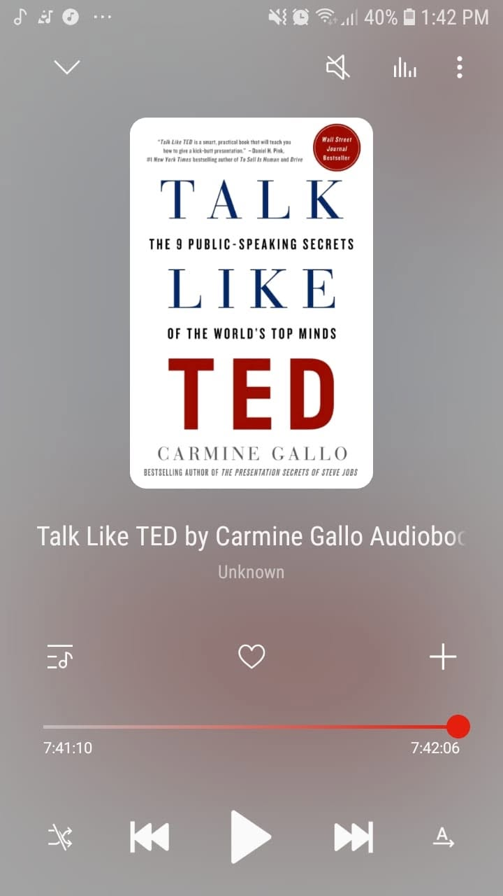

# Libro: Habla como en TED

*Habla como en TED*, de Carmine Gallo

Libro 18 de 100

«Habla como si estuvieras compartiendo un secreto».

Para comunicadores, oradores y narradores, vale la pena echarle un vistazo.

Si has pasado mucho tiempo viendo charlas TED y preguntándote por qué resulta tan fácil escuchar a algunos ponentes, este libro analiza buena parte de lo que hace que esas charlas funcionen.

No solo la forma de exponer.

La estructura.

La emoción.

Las historias.

La forma de simplificar una idea lo suficiente para que se entienda sin que parezca que ha perdido su esencia.

Algo que me gustó es que no propone copiar palabra por palabra a los ponentes de TED. Se trata más bien de comprender por qué ciertas charlas conectan con las personas.

Habla cuando tengas algo que merezca la pena decir.

Hazlo personal.

Dale a la gente una razón para que le importe.

Y no te limites a volcar información sobre ella.

Cuéntale algo que vaya a recordar.

Al final, comunicarse bien no consiste solo en parecer inteligente.

Consiste en hacer que una idea sea lo bastante clara, humana e interesante como para que alguien quiera seguir escuchando.

**Ideas que vale la pena compartir.**
