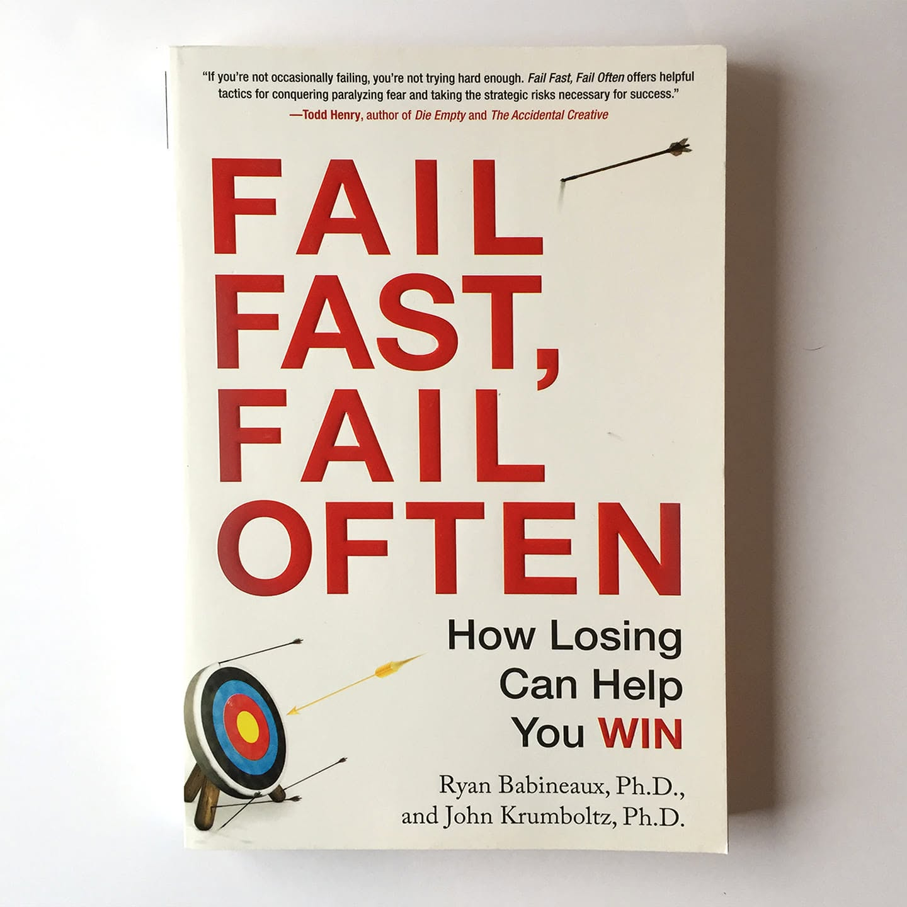

# Libro: Fracasa pronto, fracasa a menudo

*Fracasa pronto, fracasa a menudo*, de Ryan Babineaux

Libro 21 de 100

«Hazlo mal lo más rápido que puedas».

Una lectura interesante, aunque diría que el título es un poco engañoso.

Empecé esperando algo más centrado en el fracaso en sí, en cómo recuperarse, aprender rápido y seguir adelante.

En cambio, el libro gira alrededor de una idea central, pero se ramifica hacia muchas otras áreas del desarrollo personal.

Prueba cosas.

Deja de esperar hasta sentirte completamente preparado.

Experimenta.

Acepta que puedes parecer estúpido.

Y, sobre todo, no dediques tanto tiempo a prepararte para algo que nunca llegues a empezar.

Esa parte me gustó.

A veces hacer algo mal sigue siendo mejor que pasar meses intentando encontrar la forma perfecta de empezar.

Aprendes más al hacerlo de verdad.

Aun así, el libro me resultó un poco disperso.

Se parece al estilo de Seth Godin.

Hay muchas ideas buenas y frases para citar, pero a veces parecen reflexiones que funcionarían mejor como artículos de blog independientes que como un libro completo.

Así que sí.

No está mal.

Tampoco es especialmente memorable.

Simplemente otra lectura corriente con algunos buenos recordatorios escondidos entre sus páginas.
