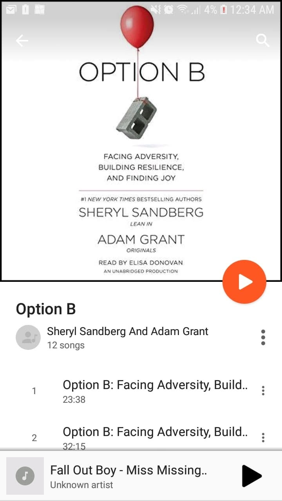

# Libro: Opción B

*Opción B*, de Sheryl Sandberg y Adam Grant

Libro 22 de 100

«La vida solo puede comprenderse mirando atrás, pero está hecha para vivirse avanzando».

Perder a un ser querido te cambia la vida.

Y este libro muestra cómo la tragedia no termina con quien se va. En muchos sentidos, su peso sigue acompañando a quienes se quedan.

El duelo cambia las rutinas.

Las relaciones.

Los planes.

Incluso la forma en que imaginas el futuro.

Hay algunas ideas de este libro que se me quedaron grabadas:

1. **Las parejas crecen al apoyarse mutuamente, pero la individualidad sigue importando.**

Es natural depender el uno del otro.

Forma parte de ser pareja.

Pero creo que también es importante que ambos sigan creciendo como individuos, con su propia confianza, sus habilidades, sus relaciones y su capacidad para tomar decisiones.

Estar juntos no debería significar volverse incapaces de valerse por sí mismos.

----------------------------------------------

2. **Ayúdense a crecer sin resolverlo todo por el otro.**

Al principio, esto puede sonar un poco duro.

Pero no creo que la idea sea mirar desde lejos cómo tu pareja pasa dificultades.

Se trata más bien de saber cuándo ayudar y cuándo darle suficiente espacio para encontrar sus propias soluciones.

A veces apoyar significa intervenir.

A veces apoyar significa decir:

**Sé que puedes con esto, y estoy aquí si me necesitas.**

Quizá así es como dos personas crecen individualmente sin dejar de crecer juntas.

----------------------------------------------

3. **Prepárense para aquello en lo que nadie quiere pensar.**

Los seguros no son precisamente el tema de conversación más emocionante.

Pero una lección práctica de un libro sobre la pérdida es que a la tragedia no le importa si tus finanzas están preparadas.

En su forma más sencilla, un seguro sirve para transferir parte de ese riesgo financiero, de modo que quienes dejas atrás no tengan que cargar con todas las dificultades además de lo que ya están viviendo.

De todos modos, tú no estarás para disfrutar de la indemnización.

Las personas que te importan, sí.

Probablemente eso ya sea motivo suficiente para pensarlo.

----------------------------------------------

En conjunto, *Opción B* trata de lo que ocurre cuando **la opción A deja de estar disponible**.

No siempre llegas a superar algo.

A veces simplemente aprendes a vivir alrededor del espacio que dejó.

Bueno.

Ya estamos entrando en el segundo trimestre del año y apenas llevo alrededor de una cuarta parte de mi objetivo de lectura.

Sigo apuntando a 100 lecturas antes de fin de año, junto con otros dos grandes objetivos audaces para este año.

Llueva o haga sol.
