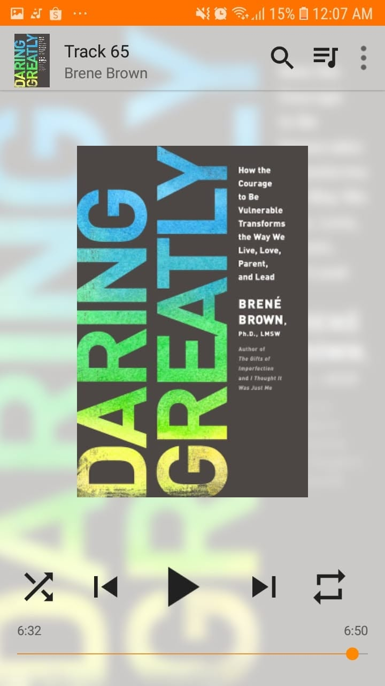

# Libro: Atreverse a lo grande

*Atreverse a lo grande*, de Brené Brown
Libro 24 de 100

«No es el crítico quien cuenta; no el hombre que señala cómo tropieza el fuerte o en qué podría haber actuado mejor quien hace las cosas.

El mérito pertenece al hombre que está realmente en la arena, con el rostro marcado por el polvo, el sudor y la sangre... que, en el mejor de los casos, conoce al final el triunfo de un gran logro y que, en el peor, si fracasa, al menos fracasa atreviéndose a lo grande».

Theodore Roosevelt, *El hombre en la arena*

Creo que esa cita ya recoge buena parte de lo que intenta decir este libro.

Es fácil quedarse fuera de la arena y señalar lo que alguien podría haber hecho mejor.

Es mucho más difícil entrar, asumir el riesgo, exponerte al fracaso, a las críticas, a la vergüenza y a la incertidumbre, y aun así decidir presentarte.

Probablemente eso fue lo que más me gustó de *Atreverse a lo grande*.

La vulnerabilidad no tiene por qué ser debilidad.

A veces es, simplemente, el precio de intentar algo que importa de verdad.

Puede que fracases.

Puede que parezcas estúpido.

Puede que te critiquen personas que ni siquiera lo intentaron.

Pero, al menos, estuviste allí.

En la arena.

En cuanto al reto de lectura, he estado ocupado con muchas cosas durante los últimos dos meses. Aun así, he conseguido escuchar algunos audiolibros en los ratos libres, aunque con mucho menos tiempo que antes.

Todavía queda mucho camino.

Pero seguiré intentando llegar al libro número cien antes de diciembre.
