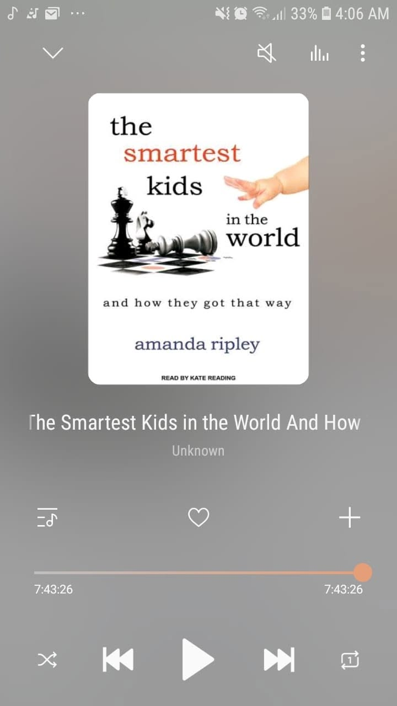

# Libro: Los niños más inteligentes del mundo

*Los niños más inteligentes del mundo*, de Amanda Ripley

Libro 25 de 100

«Era implacable y excesivo, sí, pero también parecía más honesto.

Los niños de países donde la educación era como una rueda de hámster sabían lo que era enfrentarse a ideas complejas y pensar fuera de su zona de confort. Comprendían el valor de la perseverancia. Sabían lo que era fracasar, esforzarse más y mejorar. Estaban preparados para el mundo moderno».

Para educadores y docentes, la pregunta es: **¿Cómo ofrecer una educación de primer nivel?**

Y para los padres: **¿Cómo encontrarla?**

Pero supongo que la principal lección que me llevo de este libro es mucho más sencilla:

**La educación no empieza en las aulas.
La educación empieza en casa.**

Las escuelas importan, por supuesto.

Los docentes importan.

También importan el programa de estudios, los recursos, las expectativas y el entorno en el que crecen los alumnos.

Pero, mucho antes de que un niño se siente en un aula, ya está recibiendo lecciones en casa.

Cómo se afronta el fracaso.

Cómo se fomenta la curiosidad.

Si las preguntas son bienvenidas.

Si el esfuerzo importa más que limitarse a acertar la respuesta.

Y quizá esa base moldee la forma en que el estudiante acaba abordando el aprendizaje en cualquier otro lugar.

No diría que esta sea una guía definitiva para padres o educadores.

Pero sí ofrece una mirada interesante a los retos que afrontan estudiantes de distintas partes del mundo, cómo fracasan, cómo se recuperan y qué esperan de ellos sus sistemas educativos.

Distintos países.

Distintas aulas.

Distintos enfoques.

Pero la misma pregunta de fondo: **¿Cómo ayudamos a las personas a aprender a aprender?**
