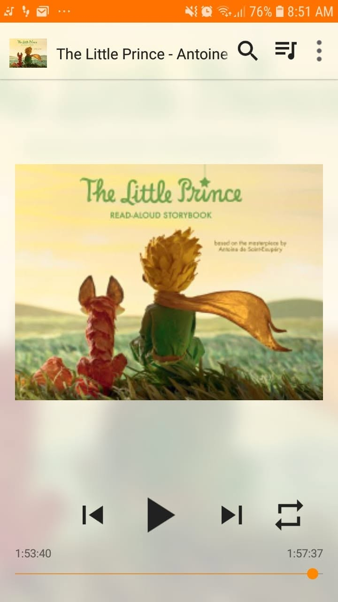

# Libro: El principito

*El principito*, de Antoine de Saint-Exupéry

Libro 29 de 100

«Todos los adultos fueron niños alguna vez... pero pocos lo recuerdan».

Una historia tan sencilla que, aun así, consigue decir mucho sobre crecer, la amistad, el amor, la soledad y las cosas en las que poco a poco dejamos de fijarnos al hacernos mayores.

Quizá por eso funciona tan bien *El principito*.

Parece un libro infantil, pero probablemente muchas de sus lecciones cobren más sentido cuando ya no eres un niño.

En algún punto del camino, nos ocupamos demasiado de los números, las responsabilidades, los planes y todo aquello que creemos importante.

Entonces llega un pequeño príncipe y nos recuerda que quizá hemos olvidado cómo mirar bien las cosas.

A veces crecer no consiste en dejar atrás la infancia.

Quizá consista en recordar qué partes de ella merecía la pena conservar.

