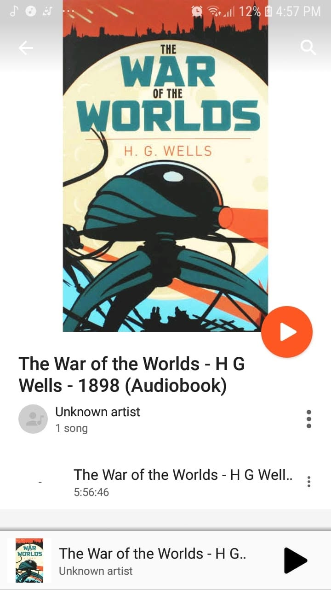

# Libro: La guerra de los mundos

*La guerra de los mundos*, de H. G. Wells
Libro 31 de 100

Después de una serie de acontecimientos, por fin conseguí retomar mis lecturas.

En junio leí el clásico original de ciencia ficción que después inspiró varias adaptaciones, incluida la película de Spielberg.

Siempre es interesante volver a la obra original cuando ya conoces la historia por una película.

Reconoces las ideas principales, la invasión, el pánico y la impotencia, pero el libro le da a todo una atmósfera distinta.

Hay algo más inquietante en ver cómo personas corrientes comprenden poco a poco que el mundo que conocen ya no funciona como creían.

Y, teniendo en cuenta lo antigua que es la novela, ha envejecido sorprendentemente bien.

En fin, esta me pareció una buena manera de volver a poner en marcha el hábito de leer.

Hora de reajustarlo todo, recuperar el ritmo y retomar el rumbo habitual.
