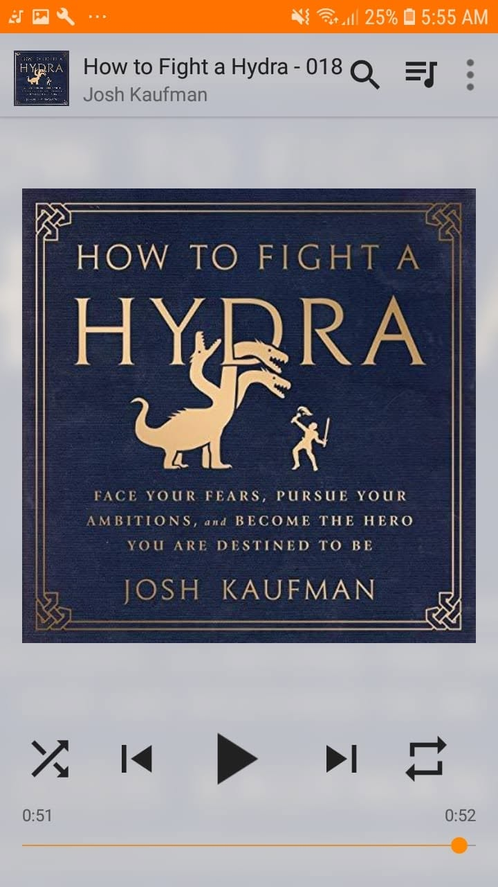

# Libro: Cómo luchar contra una hidra

*Cómo luchar contra una hidra*, de Josh Kaufman

Libro 36 de 100

«Cuando dejo de aferrarme a lo que soy, me convierto en lo que podría ser».

Una lectura bastante breve y, en realidad, más bien una metáfora de las distintas dificultades que afrontamos en la vida.

Es ligera, sencilla y fácil de terminar de una sentada.

No es el típico libro de autoayuda que intenta abrumarte con métodos o consejos interminables. Se lee más como un cuento para antes de dormir con una lección escondida debajo.

Y quizá por eso funciona.

La hidra se convierte en cualquier cosa difícil que tengas delante.

Un riesgo.

Un problema.

Una decisión que llevas evitando.

Algo que parece demasiado grande, demasiado incierto o demasiado incómodo para afrontarlo.

La idea principal es sencilla:

Asume el riesgo.

Enfréntate a ello.

Mira qué pasa.

Porque, a veces, la grandeza no llega por esperar hasta sentirte completamente preparado.

A veces empieza al decidir avanzar de todas formas. 🚀

Y, al cerrar la última página, el libro te deja una pregunta:

**¿A qué hidra te enfrentas hoy?**
