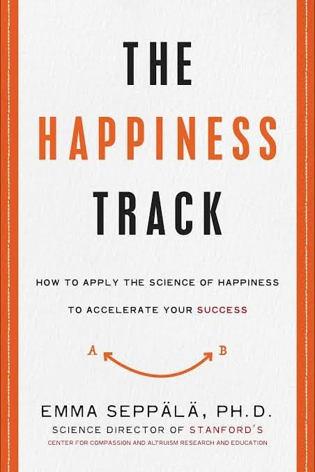

# Libro: El camino de la felicidad

*El camino de la felicidad*, de Emma Seppälä
Libro 37 de 100

«La felicidad tiende a extenderse hasta tres grados de separación de ti, a quienes tienes cerca e incluso a desconocidos que nunca llegarás a conocer».

Otra lectura de agosto terminada.

Sinceramente, esta no me convenció demasiado.

Sí encontré algunas ideas útiles, sobre todo acerca de ser más compasivo contigo mismo y con los demás, bajar el ritmo y no tratar la productividad como una carrera interminable.

Esas partes estaban bien.

Pero, cuanto más avanzaba, más sentía que algunos argumentos se contradecían o simplemente repetían ideas que ya había encontrado en otros libros de psicología y autoayuda.

Por momentos, parecía menos un argumento sólido y más una colección de conceptos conocidos, unidos y respaldados por distintos estudios y artículos.

Quizá resulte útil si es la primera vez que te encuentras con estas ideas.

Pero, para mí, no aportaba nada especialmente nuevo.

Así que sí.

Otra lectura no demasiado buena para la lista.

Supongo que no pueden gustarte todos los libros.

En fin, aun así ha sido un buen fin de semana, y espero que la próxima semana sea mejor.

