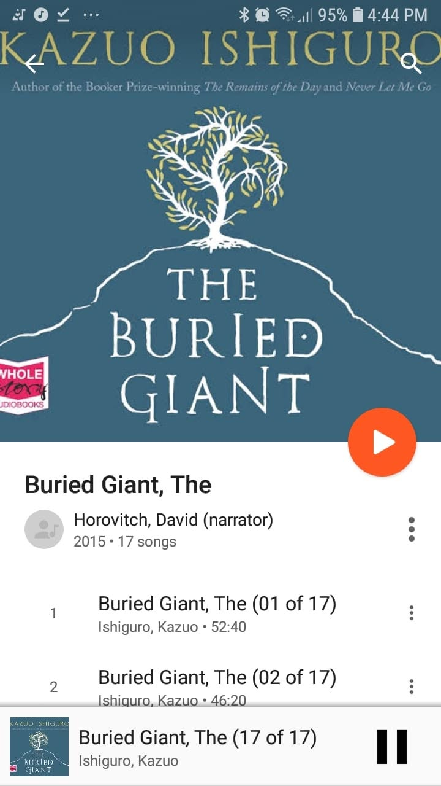

# Libro: El gigante enterrado

*El gigante enterrado*, de Kazuo Ishiguro
Libro 38 de 100

«Algunos de ustedes tendrán hermosos monumentos con los que los vivos podrán recordar el mal que les hicieron. Otros solo tendrán cruces de madera toscas o piedras pintadas, mientras que otros deberán permanecer ocultos en las sombras de la historia».

Hasta el final, seguí pensando que tenía que haber algún tipo de bucle temporal.

La verdad es que lo esperaba.

Toda la historia transmite esa extraña sensación de recuerdos que se escapan, de personas que intentan aferrarse a fragmentos del pasado sin estar del todo seguras de que sean ciertos.

Y eso me dejó pensando:

**¿De verdad había secretos enterrados en el pasado, o algunos eran solo recuerdos que las personas se habían convencido de que eran reales?**

Probablemente eso fue lo que más se me quedó.

El libro parece menos interesado en dar respuestas claras que en preguntar qué ocurre cuando las personas recuerdan demasiado o se olvidan de demasiado.

Quizá olvidar pueda protegernos.

Quizá recordar pueda hacernos daño.

Quizá ambas cosas sean necesarias.

Puede que este libro esté lleno de simbolismo.

O quizá no.

En cualquier caso, interprétalo como quieras.

