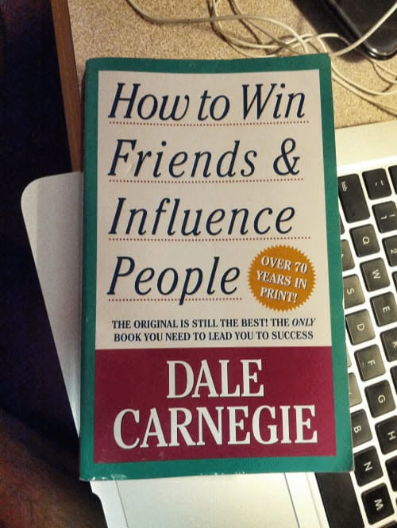

# Libro: Cómo ganar amigos e influir sobre las personas

*Cómo ganar amigos e influir sobre las personas*, de Dale Carnegie

Libro 41 de 100

Esta es la parte incómoda de muchos libros de autoayuda que prometen ayudarte a ser más persuasivo, tener más confianza o ganarte mejor a los demás:

A veces, la línea entre **influir en las personas** y **utilizarlas** puede ser bastante fina.

Esa fue, probablemente, mi principal reflexión al leer este libro.

Sin duda contiene muchas ideas útiles, especialmente sobre escuchar, mostrar un interés sincero, evitar discusiones innecesarias y comprender cómo quieren ser tratadas las personas.

Pero muchos ejemplos también parecían muy influidos por las ventas, la negociación y la idea de conseguir que la gente diga que sí.

Y ahí es donde se pone interesante.

La misma habilidad puede servir para construir mejores relaciones o, simplemente, para obtener algo de alguien.

Supongo que la diferencia está en la intención.

¿Intentas comprender mejor a las personas?

¿O solo intentas averiguar qué botones pulsar?

Aun así, es difícil ignorar la influencia que ha tenido este libro.

Muchos libros actuales sobre ventas, comunicación, persuasión y liderazgo parecen deberle a Carnegie al menos una parte de sus ideas.

Así que, aunque no estuve de acuerdo con todo, entiendo por qué se convirtió en un clásico.

Quizá no sea una guía perfecta de las relaciones humanas.

Pero sin duda es una de las bases de los libros modernos sobre influencia.

