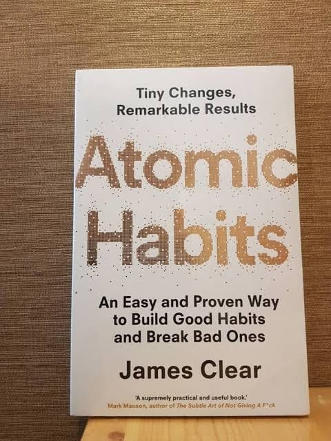

# Libro: Hábitos atómicos

Libro 45 de 100

«Las metas no distinguen a las personas porque, como puedes ver, quienes ganan y quienes pierden suelen tener las mismas metas. La verdadera pregunta es: ¿quién seguirá adelante y estará a la altura?».

En realidad, terminé este libro en octubre, pero con todo lo que pasó durante los últimos dos meses de 2019, solo logré alcanzar la mitad de mi objetivo de leer 100 libros en el año.

Aun así, se siente bien estar de vuelta.

Es hora de sembrar nuevos hábitos para 2020.

«Cuando no puedas ganar siendo mejor, gana siendo diferente».

