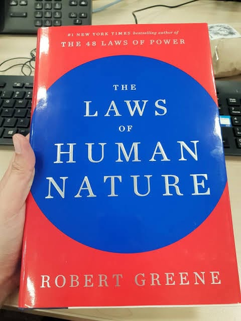

# Libro: Las leyes de la naturaleza humana

*Las leyes de la naturaleza humana*, de Robert Greene
Libro 46 de 100

«El ser humano solo mejorará cuando le hagas ver cómo es».

Última lectura de 2019.

En realidad, lo terminé durante la última semana de diciembre, después de lo que parecieron casi tres meses de lectura intermitente hasta llegar por fin al último capítulo.

Es una lectura larga, pero supongo que encaja con el tema.

Intentar comprender a las personas, sus motivos, sus inseguridades, sus hábitos y su forma de reaccionar ante el mundo no es algo que pueda resumirse en unas pocas páginas.

Y quizá una de las partes más difíciles sea darse cuenta de que muchas de esas observaciones también se aplican a uno mismo.

Es fácil analizar a los demás.

Es mucho más difícil reconocer tus propios patrones, admitir que te equivocas y darte cuenta de las cosas que sigues haciendo sin saber muy bien por qué.

No alcancé mi objetivo de lectura del año, pero no pasa nada.

Siempre habrá otro año para volver a intentarlo.

Así que cierro los libros del año pasado y abro unos cuantos capítulos nuevos para este.

