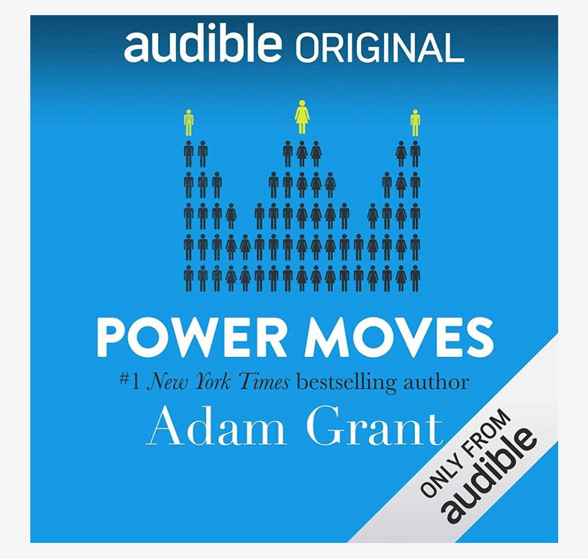

# Libro: Movimientos de poder desde Davos

*Movimientos de poder desde Davos*, de Adam Grant
Libro 3 de 100

Los buenos líderes suelen encajar en una de estas categorías:

Los dominantes.
Los cercanos.
Los orientados a los logros.

Este libro reúne muchas ideas interesantes sobre el liderazgo.

Lo que más me llamó la atención es que esas etiquetas nunca son del todo absolutas.

Las personas no encajan perfectamente en una sola casilla.

Un líder puede ser dominante cuando hay que tomar una decisión difícil, cercano cuando el equipo necesita apoyo y orientado a los logros cuando todos necesitan un empujón hacia un objetivo mayor.

Y, si tenemos suerte, en algún momento de nuestra carrera trabajamos con alguien que sabe cuándo pasar de un estilo a otro.

Quizá así sea realmente un buen liderazgo.

No consiste en elegir una personalidad y mantenerla para siempre, sino en comprender a quienes te rodean, interpretar la situación y saber cuándo liderar de otra manera.

Porque a veces las personas necesitan orientación.

A veces necesitan ánimo.

Y a veces solo necesitan a alguien que crea que pueden hacerlo mejor.

Entonces, ¿en qué parte de ese espectro de liderazgo crees que estás?

