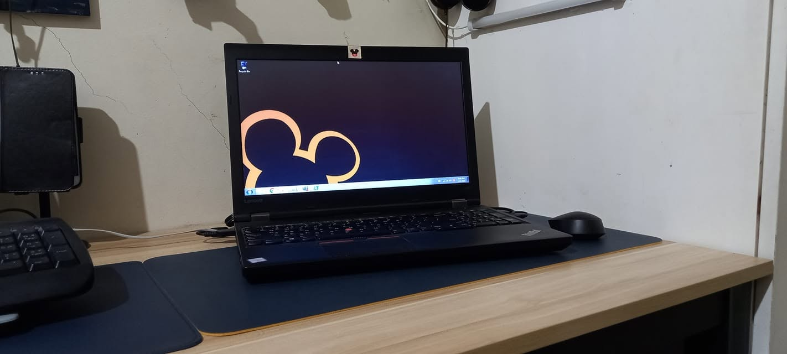

# Adiós, Disney

Y llegó el día.

Iniciando sesión por última vez.

Es extraño cómo algo que has hecho casi a diario acaba convirtiéndose en algo que harás por última vez.

Un último inicio de sesión.

Una última mirada a las herramientas, mensajes, tickets, sistemas y todas esas otras cosas que poco a poco se volvieron parte de la rutina.

Una última mirada a Disneyland.

Me llevo mucho de mi tiempo aquí.

Aprendí muchísimo del equipo de Filipinas, especialmente al ver cómo se construyen, mantienen y arreglan las aplicaciones, y cómo a veces se rompen antes de volver a arreglarse.

Aprendí tanto o más del equipo de Estados Unidos. Las redes ya eran un terreno conocido para mí, pero siempre hay una diferencia entre lo que sabes por los libros y las certificaciones y lo que ves cuando todas las piezas funcionan juntas en el mundo real.

Y, por supuesto, también aprendí muchísimo de la **Casa del Ratón**.

Distintos equipos. Distintas personas. Distintos problemas.

Algunos días fueron tranquilos.

Otros, desde luego, no.

Hubo cosas que entendí de inmediato y otras que me llevaron a pasar horas buscando en Google, leyendo documentación, mirando registros y preguntándome qué demonios se me escapaba.

Pero supongo que es parte del proceso.

No te das cuenta de cuánto has aprendido por el camino hasta que estás a punto de irte y, de repente, empiezas a mirar atrás.

Los sistemas en los que he trabajado, los problemas que he encontrado, las personas de las que he aprendido e incluso los errores que he cometido se han convertido en pequeñas experiencias que me llevaré adonde vaya.

Y ahora toca cerrar este capítulo.

Tomando prestada una frase de *Closing Time*:

**«Todo nuevo comienzo nace del final de otro comienzo».**

Así que sí.

A por un nuevo comienzo increíble.

