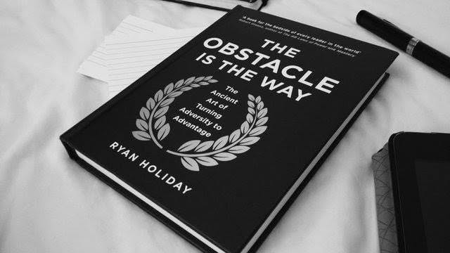

# Libro: El obstáculo es el camino

*El obstáculo es el camino*, de Ryan Holiday

Ideas principales:

1. **Como haces una cosa, haces todas las demás.**
2. **Lo que impide la acción hace avanzar la acción.**
3. **Lo que se interpone en el camino se convierte en el camino.**

Han pasado unos dos años desde la última vez que leí algo no técnico, así que este fue un cambio de ritmo agradable.

Lo que más me gustó fue lo sencilla que es la idea central.

No siempre puedes eliminar el obstáculo.

A veces tienes que trabajar con él.

Un contratiempo puede obligarte a bajar el ritmo, replantearte el enfoque o encontrar una ruta que probablemente no habrías considerado si todo hubiera salido bien.

Eso no significa que cada problema sea una bendición disfrazada.

A veces un problema es solo un problema.

Pero tu respuesta sigue importando.

Puedes gastar toda tu energía deseando que la situación fuera distinta, o empezar a preguntarte qué puedes hacer realmente con lo que tienes delante.

Y quizá ahí empiece el progreso.

En fin, qué gusto volver a leer algo fuera de los temas técnicos.

¡Ahora, a por el siguiente!

