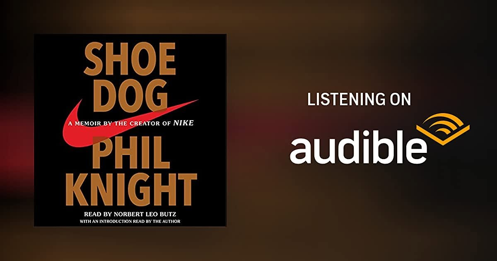

# Libro: Nunca te pares (Shoe Dog)

*Nunca te pares (Shoe Dog)*, de Phil Knight

«Registra el pasado, traza el futuro. No te conformes con un empleo o una profesión. Busca una vocación, aunque no sepas qué significa. El cansancio será más fácil de soportar, las decepciones serán combustible y los momentos de euforia no se parecerán a nada que hayas sentido antes».

He terminado el audiolibro por tercera vez.

La primera fue en 2017 y la segunda en 2019. Después de un par de años centrado sobre todo en trabajar, quedarme en casa y gestionar la vida tal como venía, por fin volví a escuchar esta joya.

Buenísimo.

Lo que me gusta de *Nunca te pares* es que la historia nunca parece un camino perfectamente calculado hacia el éxito.

Buena parte es incertidumbre.

Malas decisiones.

Problemas de dinero.

Personas que se arriesgan por ideas que podrían haber fracasado fácilmente.

Planes que cambian porque la realidad tenía otras intenciones.

Y, aun así, siguieron avanzando.

Creo que eso es lo que más se me quedó esta vez.

La balanza puede inclinarse a tu favor o no, pero sigues teniendo que trabajar con lo que tienes delante.

Los recursos disponibles.

Las personas dispuestas a ayudar.

Los errores que ya has cometido.

Las oportunidades que, de alguna manera, sobrevivieron a todos esos errores.

No siempre tienes condiciones ideales antes de empezar algo.

A veces simplemente empiezas, ajustas sobre la marcha, encajas los golpes y averiguas el siguiente paso cuando llega el momento.

Quizá el camino se aclare después.

Quizá no.

En cualquier caso, sigues avanzando.

En pocas palabras:

**Simplemente hazlo.**

