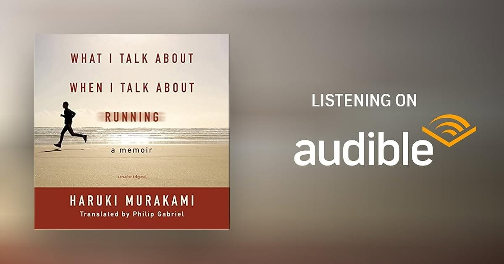

# Libro: De qué hablo cuando hablo de correr

*De qué hablo cuando hablo de correr*, de Haruki Murakami

Libro 1 de 2024

Bueno, técnicamente este es el tercer libro que termino desde enero.

Lo acabé hacia mediados de febrero, pero hace poco decidí empezar a llevar un registro de mis lecturas para ver cuántas consigo terminar antes de que acabe el año.

La principal lección que me llevo:

**Hasta lo más cotidiano puede convertirse en algo profundo, casi meditativo, si lo mantienes el tiempo suficiente.**

Correr parece sencillo.

Pones un pie delante del otro y sigues avanzando.

Pero hazlo de forma constante durante años y se convierte en algo más que ejercicio. Se vuelve rutina, disciplina, soledad, reflexión y, a veces, una forma de comprenderte un poco mejor.

Y creo que eso se aplica a muchas cosas.

Escribir.

Aprender.

Trabajar.

Cualquier actividad que te exija volver una y otra vez, incluso los días en los que no pasa nada especialmente emocionante.

No todo tiene que sentirse profundo mientras lo haces.

A veces el sentido solo aparece después de repetir lo cotidiano el tiempo suficiente para mirar atrás y darte cuenta de cuánto te ha cambiado.

Sigue avanzando.

La distancia se acumula.

