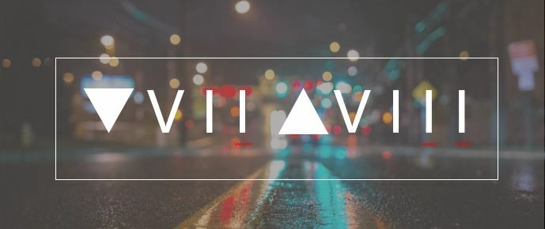
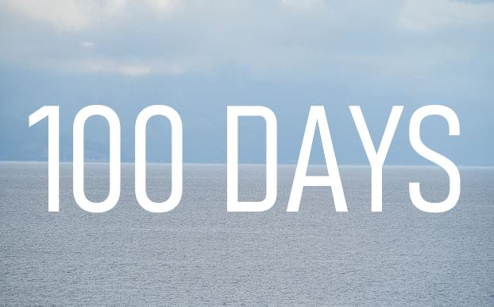
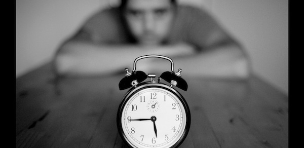

# Levántate ocho veces

> Este es un borrador que escribí hace tiempo, probablemente hacia diciembre de 2021.

Cuando tengo un mal día, o pasa algo de mierda y nada quiere salir como lo había planeado, suelo recurrir a una de dos cosas.

O salgo a correr hasta perderme por completo en el momento, o me siento a escribir lo que me pasa por la cabeza.

Por desgracia, se espera que una tormenta toque tierra en nuestra zona y no me apetecía quedarme atrapado por ahí cuando empezara el aguacero.

Antes sí pude saltar un rato a la cuerda en la zona de la piscina de mi edificio.

Y, mientras buscaba el equilibrio entre saltos, mi mente decidió pasar una presentación continua de todo lo ocurrido durante los últimos seis meses.

Como al empezar cada año, solemos ser optimistas y pensar que los próximos 365 días traerán algo mejor.

Al menos así me imaginaba 2021.

No esperaba que todo volviera de pronto a la normalidad, claro. Seguíamos en plena pandemia, y salir sin mascarilla todavía quedaba bastante lejos.

Los países empezaban a abrirse y a relajar algunas restricciones conforme avanzaba la vacunación, aunque seguía habiendo muchas limitaciones en todas partes.

Aquí también se vacunaba a la gente, pero a un ritmo mucho más lento y dando prioridad a quienes más lo necesitaban.

Por mi parte, ninguna queja.

Pudimos registrarnos para la vacunación a través del gobierno local, así que solo nos quedaba esperar nuestro turno.

En fin.

Volviendo al tema.

Terminé mi primer **reto #100DaysOfCode** el 14 de febrero.

Con la sensación de haber ganado, decidí empezar otra ronda de inmediato.

Al día siguiente volvió a ser el **día 1**.

Después, el día 2.

El día 3.

Hubo algunos baches, pero seguí adelante. Entonces alguien me contactó por una oportunidad para un puesto nuevo en su empresa. No estaba pensando seriamente en cambiar de trabajo, pero me pareció que no perdía nada por escuchar.

Una persona de selección me llamó e hicimos una breve entrevista inicial.

No estaba demasiado preparado, así que probablemente dejé fuera algunos puntos importantes que debería haber mencionado.

Después no volvieron a llamar.

Y, sinceramente, no me preocupó, porque poco después me contactaron otras dos empresas.

En su momento no lo admití, pero aquellas llamadas sí alimentaron un poco mi ego.

Sabía que probablemente buscaban a alguien con mucha más experiencia, y yo todavía me veía en un punto intermedio en cuanto a capacidades.

He aprendido mucho trabajando en distintos sectores durante los últimos cinco años, pero también sé que aún estoy lejos de ser un experto.

Aun así, decidí intentarlo.

Pasé las entrevistas telefónicas, renové mi perfil, actualicé todo y empecé a enviar candidaturas.

Luego me enganché a las reuniones y entrevistas con distintas empresas después del trabajo.

Al final, dejé mi **#100DaysChallenge** y me concentré en esas reuniones.

## Los dos «casi»

Llegué bastante lejos en el proceso con dos empresas distintas.

Un puesto se centraba en automatización de infraestructura con AWS.

El otro era de soporte de Docker y Kubernetes.

Ambos parecían prometedores.

Ambos mostraban interés.

Valoré con cuidado mis posibilidades en cada uno y, después de varias conversaciones con mi esposa, decidí que estaba listo para dar el paso hacia algo nuevo.

En ese momento solo quedaba una cosa por hacer. Esperar.

Así que esperé.

Y pasó una semana.

Por fin llegó una oferta para el puesto de soporte.

Por desgracia, era inferior a lo que esperaba, y no quería dejar las oportunidades que ya tenía en mi trabajo para ir a otro sitio con unas condiciones casi iguales.

Había tenido buenas conversaciones con tres responsables de equipo distintos, y me dieron la impresión de que de verdad querían que me incorporara.

Lamentablemente, la persona de selección terminó diciéndome que no continuarían con mi candidatura.

Eso dolió un poco.

Por supuesto, entiendo que una empresa tiene todo el derecho a reconsiderarlo si deja de ver sentido en la contratación.

Le comenté mi preocupación a la persona con la que llevaba más de un mes coordinándome, pero ya intuía que habíamos llegado al final.

Así que le agradecí toda su ayuda y seguí adelante.

Además, todavía me quedaba otra oportunidad.

O eso creía.

La segunda se alargó casi dos meses y exigió muchos mensajes de seguimiento.

Cada vez que preguntaba, me decían que la dirección seguía revisándolo todo.

Así que esperé. Y seguí esperando.

Para entonces, ya había dejado de atender a otros posibles empleadores porque me había centrado casi por completo en esta oportunidad.

Sabía que no debía hacer planes alrededor de una decisión que todavía podía cambiar.

Pero tenía buenas sensaciones sobre cómo había ido la entrevista con el panel técnico.

Tres semanas se convirtieron en cinco.

Cinco en siete.

En la octava semana contacté a mi amigo, que trabajaba allí y me había recomendado para el puesto.

Le pregunté si había sabido algo de la persona de selección.

Recibió exactamente la misma respuesta que yo.

A la semana siguiente me escribió.

Habían decidido dejar mi perfil en espera por el momento.

Eso sí fue devastador.

Con las dos oportunidades perdidas, volvía a la casilla de salida.

Ya había pasado por muchos rechazos.

Y cuando digo muchos, son muchos.

Probablemente he dedicado cientos, quizá miles, de horas a candidaturas y entrevistas desde que terminé la universidad.

¿Pero estos dos?

Joder.

Se sintieron distintos.

## Levántate cinco veces

Intenté volver a mi rutina habitual.

Admito que no fue fácil sacarme de la cabeza esas dos posibilidades que no llegaron a ser.

Entonces enfermé.

Dos veces.

Perdía muchos líquidos y me quedé tan débil que apenas podía funcionar durante casi una semana en cada ocasión.

No quise darle demasiadas vueltas porque acabé recuperándome con medicación, pero en esos dos periodos pasé la mayor parte del tiempo en la cama.

Sin correr.

Sin entrenar.

Sin nada.

Mi cuerpo estaba, básicamente, fuera de servicio.

Con el tiempo me recuperé físicamente.

¿Pero la ansiedad que seguía bullendo debajo de todo?

Esa no desapareció tan fácilmente.

## Levántate seis veces

Al final llegó otra llamada.

Y esta vez me llevé el oro.

Todavía le di muchas vueltas antes de decirles a los equipos de mi trabajo que me marchaba para tomar otro rumbo.

Todos fueron increíblemente amables.

Mis compañeros y responsables fueron cálidos, generosos y me apoyaron.

La verdad es que, de haber podido, probablemente me habría llevado a algunos compañeros conmigo.

Cambiar es difícil.

Cambiar es incómodo.

Pero, a veces, cambiar es necesario para crecer.

## Levántate siete veces

Unos días antes de mi última semana de trabajo, volví a enfermar.

Esta vez fueron los ojos.

No entraré demasiado en los detalles, pero afectó seriamente a mi productividad.

Por esas fechas intenté reiniciar otra vez mi **reto #100DaysOfCode**.

Y, una vez más, tuve que abandonarlo porque todo lo que estaba pasando me tenía demasiado desorientado.

Entonces, como si la vida no nos hubiera dado ya bastante, a mi esposa le diagnosticaron nódulos en dos partes distintas del cuerpo.

Naturalmente, estábamos preocupados.

Esperábamos que el médico nos dijera que bastaba con vigilarlos de momento o que recetara alguna medicación.

En lugar de eso, nos dijeron que había que extirparlos.

Lo que siguió fue una tarde entera corriendo de un sitio a otro para hacer pruebas de laboratorio y entregar todos los documentos necesarios.

Al día siguiente estábamos en una habitación de hospital.

Por suerte, nuestro seguro médico cubría los gastos.

En ese momento, lo único por lo que teníamos que preocuparnos era por cómo saldría la operación.

## Levántate ocho veces

Han pasado casi cuatro días desde que salimos del hospital y volvimos a casa.

Mi esposa está mucho más fuerte, aunque los puntos todavía están cicatrizando.

Mis ojos también se están recuperando.

Si el tiempo acompaña, quizá mañana por la mañana vuelva a intentar correr.

Y, en medio de todo lo ocurrido, también conseguí aprobar el examen de certificación **AWS SysOps Associate**.

Ahora estoy en el día 3 de mi nuevo trabajo.

Hace seis meses, probablemente no habría creído a nadie que me dijera que así sería mi primera semana en una empresa nueva.

Empezar un trabajo mientras estoy completamente ocupado con lo que pasa en casa.

Siempre me he dicho que, al entrar en un entorno nuevo, quiero dedicarle toda mi atención, sin dividirla.

Bueno.

Hasta ahí llegó aquel plan.

Por mucho que fastidiara recibir un golpe tras otro durante los meses anteriores, no puedo decir que fueran los peores días de nuestra vida.

Hemos pasado por cosas peores.

Aunque, desde luego, recibimos una buena paliza.

Pero lo superamos, ¿no?

Vaya si aquellos baches me obligaron a frenar más veces de las que quería.

A veces no tienes opción.

Bajas el ritmo.

Te reorganizas.

Recargas energías.

Recuperas el aliento.

Usa el verbo que quieras.

Y, por extraño que parezca, a veces el universo sí parece echar una mano cuando todo empieza a pesar demasiado.

No espero que, a partir de ahora, todo vaya sobre ruedas.

Probablemente no será así.

Lo que sí sé es que intentaré resolver lo que tenga solución.

Aceptar las pérdidas cuando haga falta.

Recibir los golpes.

Y después levantarme.

A la octava.

A la novena.

O a la centésima.

Las veces que haga falta.

---------------------------

Si has leído hasta aquí, quiero darte las gracias de corazón.

Sé que este suele ser un espacio para temas técnicos,
pero quería compartir una parte de mí que no se limita
al trabajo, los estudios, las certificaciones o la programación.

A veces también está todo lo que ocurre entre una cosa y otra.

