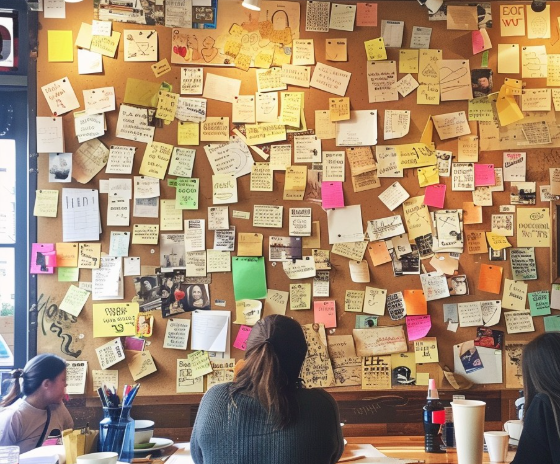

# Un café, por favor

Me desperté con esa puta canción sonando otra vez en mi cabeza.

Habían pasado cuatro días.

Al principio no me molestaba demasiado. La canción era bonita, aunque estuviera en un idioma que apenas entendía. Uno pensaría que eso facilitaría ignorarla, pero, por alguna estúpida razón, ocurría lo contrario. Quería entenderla.

Así que empecé a aprender el idioma.

No solo por la canción, o al menos eso era lo que me repetía.

Aprender español llevaba tiempo en algún lugar de mi lista imaginaria de cosas que acabaría haciendo algún día.

Aprender otro idioma.

Viajar más.

Correr con constancia.

Convertirme en una de esas personas que doblan la ropa nada más terminar de lavarla.

Ya sabes, cosas imposibles.

Pero entonces escuché la canción y, de repente, el español subió muchos puestos en la lista.

Empecé con unas palabras, luego frases y después preguntas. Podía entender pequeños fragmentos, aunque todavía tenía que traducir la mayoría primero. Había algo satisfactorio en escuchar algo que unas semanas antes habría sonado como ruido y darme cuenta de pronto de que sabía qué significaba, o al menos parte de ello.

El problema era que, en algún momento, le había cogido demasiado cariño a la canción en sí.

Y entonces, por razones que probablemente sea mejor no explicar, decidí que necesitaba aprender a dejar de escucharla.

## Viernes

Intenté trabajar aquella mañana, pero no conseguía concentrarme. Intenté ver algo, comí algo, recorrí lo que fuera que apareciera en el teléfono y, básicamente, hice de todo menos lo que se suponía que tenía que hacer.

Al final abrí Spotify.

Ahí estaba. La canción.

Me quedé mirándola unos segundos y me dije que no la pusiera. Luego la puse de todas formas.

Me cago en todo.

La escuché un rato antes de pararla por la mitad. Esa se había convertido en una de mis pequeñas reglas extrañas. Si no podía evitar ponerla, al menos no la terminaría.

No sé muy bien qué se suponía que iba a conseguir con eso.

Quizá pararla a medias contaba como un avance. Quizá intentaba demostrarme que todavía tenía algo de control.

En cualquier caso, unos minutos después de cerrar Spotify, la canción volvió a sonar en mi cabeza.

Me cago en todo.

Así que, hacia las 11:00 de la mañana, agarré la bicicleta.

No tenía un destino, lo cual suele ser una forma terrible de empezar lo que acabaría siendo una salida de diez horas en bicicleta. Solo sabía que quería ir a algún sitio. A cualquiera, la verdad.

Montar en bicicleta tiene algo útil cuando tu cerebro se niega a callarse. Al final, tu cuerpo está demasiado ocupado manteniéndote con vida como para atender las tonterías que pasan por tu cabeza.

Mira la carretera.

Esquiva el coche.

Cambia de marcha.

Bebe agua.

No atropelles al señor mayor.

*¿Por qué está caminando este hombre por el carril bici?*

Durante un rato funcionó.

La canción desapareció.

Así que seguí.

No llevaba demasiado control de hacia dónde iba. Primero seguí rutas ciclistas conocidas, después calles por las que solo había pasado unas pocas veces y, al final, lugares donde tenía que consultar el mapa constantemente porque no sabía muy bien dónde acabaría.

Hacía calor. Muchísimo. Un calor abrasador.

Estaba en Singapur, alrededor del mediodía, y por alguna razón había decidido que aquel era el momento perfecto para realizar el experimento psicológico que, al parecer, estaba haciendo conmigo mismo.

Paré en algún punto para beber agua y miré el teléfono. Spotify seguía ahí, obviamente, y por un segundo pensé en abrirlo.

*No.*

Sabía exactamente lo que pasaría.

La caja de Pandora podía seguir cerrada una hora más.

Guardé el teléfono en el bolsillo y volví a subir a la bicicleta.

Esa contaba como una victoria.

A primera hora de la tarde había llegado a algún punto de la costa. El mar estaba increíblemente azul aquel día y había familias por todas partes.

Niños corriendo de un lado a otro.

Ciclistas adelantándose.

Gente sentada en bancos bajo los árboles.

Seres humanos normales que, al parecer, entendían que a la playa se va a relajarse.

En un momento pasé junto a un niño que construía un gran castillo de arena. Era impresionante. Había levantado murallas, unas cuantas torres puntiagudas y una torre más alta que sobresalía en el centro. No sé cuánto tiempo llevaba con ello, pero, con el agua azul de fondo, todo parecía casi demasiado perfecto para una tarde cualquiera en la playa.

Durante unos segundos, puede que aquel fuera el lugar más feliz de la Tierra.

Seguí pedaleando, todavía mirando alrededor más de lo que probablemente debía, cuando un niño con una camiseta de Mickey Mouse se metió en el carril bici. Su padre lo apartó justo antes de que yo llegara a su altura.

Al parecer, hasta Mickey intentaba matarme aquella tarde.

Me reí al pensarlo y seguí pedaleando.

Así transcurrió básicamente la tarde. De vez en cuando, algo completamente normal me recordaba la canción.

Una palabra en un cartel.

Algo que llevaba puesto alguien.

Un chiste estúpido que recordaba.

A veces, absolutamente nada.

Ni siquiera hacía falta un motivo.

La canción simplemente decidía que era hora de volver a sonar dentro de mi cabeza.

Y cada vez que lo hacía, yo pedaleaba un poco más lejos.

En algún punto de la costa pasé junto a unos trabajadores que descargaban cajas de agua embotellada de un camión. Había decenas apiladas al lado de la carretera.

Por alguna razón, miré todas aquellas botellas y pensé: son muchas cosas que mantener cerradas.

Esperaba que nadie tuviera pensado tirarlas al Pacífico.

En fin.

Seguí pedaleando.

En algún momento, probablemente después de entrar en el segundo barrio, empecé a preguntarme qué estaba haciendo exactamente.

Hay una palabra que la gente suele usar cuando no puedes dejar de pensar en algo.

**Obsesión.**

Nunca me ha gustado esa palabra.

Quizá porque suena a que has cedido el control. Quizá porque hace que el cariño parezca una enfermedad. O quizá porque no existe una palabra precisa para esa extraña distancia entre que algo te guste y darte cuenta de que te has apegado a ello mucho más de lo que pretendías.

No lo sé.

Quizá por eso había salido en primer lugar. Un poco de distancia no podía hacer daño.

Prefería **desapego**.

Sonaba más sano.

Más maduro.

Muy psicológico.

Al parecer, la forma de lograrlo era cruzar la isla en bicicleta bajo el sol del mediodía hasta que mi piel empezara a cocinarse.

Un comportamiento sanísimo.

Así que seguí.

Al caer la tarde había cruzado dos barrios y estaba bien adentro de otro. No recuerdo exactamente cuándo empezaron a quejarse mis piernas. Probablemente varias horas antes de que decidiera escucharlas.

Hacia las cinco o las seis de la tarde, por fin paré en una cafetería.

Necesitaba cafeína. O azúcar. O suero intravenoso.

Cualquier cosa, la verdad.

Dejé la bicicleta fuera y entré. Había bastante gente, pero no estaba lleno. Algunos trabajaban con portátiles, unos grupos conversaban tomando café y otros estaban sentados en las mesas de la terraza, a pesar de que tenían aire acondicionado a unos tres metros detrás de ellos.

Pedí un café.

Mientras esperaba, me acerqué al otro extremo de la barra, donde entregaban las bebidas. Miré alrededor, sobre todo porque no tenía nada más que hacer, y entonces vi un panel enorme colgado en una de las paredes.

Estaba cubierto de fotografías y notas escritas a mano.

Me acerqué.

Algunas parecían reseñas. Otras eran mensajes sueltos que la gente había dejado. Había felicitaciones de cumpleaños, agradecimientos, bromas, dibujitos y notas claramente dirigidas a personas que no estaban allí.

Algunos mensajes eran para amigos.

Otros, para familiares.

Otros eran claramente para personas a las que querían.

Había bromas privadas que probablemente no significaban nada para nadie salvo para dos personas en algún lugar del mundo.

Pasé unos minutos leyéndolas.

Cerca de una esquina del panel había un pequeño soporte con papeles en blanco de distintos colores y tamaños. Al lado, un rotulador.

Y la canción empezó a sonar otra vez dentro de mi cabeza.

Me cago en todo.

«Un café para Chiz».

Cierto. La realidad.

Recogí el café y salí. Había unas mesas vacías en la terraza, así que elegí una y me senté.

Delante de mí había una taza de café.

Y un rotulador.

Y un pequeño trozo de papel.

----------------------------------------------

Me quedé allí sentado un rato.

La canción seguía sonando, aunque ya no tan fuerte. Quizá la bicicleta había funcionado. O quizá mi cerebro estaba demasiado cansado para mantener el volumen.

Y, por razones que en aquel momento me parecían perfectamente lógicas, empecé a preguntarme hasta dónde podría viajar una taza de café antes de enfriarse.

¿A través de una ciudad?

¿De un país?

¿Del Pacífico?

Quizá once husos horarios.

Sería un viaje bastante estúpido para una taza de café.

Sin duda llegaría fría.

Me reí al pensarlo.

Y luego me lo bebí yo.

## Se acabaron los caminos

Podría haber vuelto a casa después de eso.

De hecho, probablemente debería haberlo hecho.

Ya era avanzada la tarde, llevaba horas pedaleando y casi toda la energía que me había dado el café se estaba gastando en convencer a mis piernas de que aún no habíamos terminado.

Pero volver a casa significaba parar. Y parar significaba silencio.

Y últimamente el silencio era peligroso, porque solía ser entonces cuando la canción sonaba más fuerte.

Así que volví a subirme a la bicicleta.

La tarde se convirtió poco a poco en noche. El calor se hizo algo más llevadero, los edificios empezaron a iluminarse y la gente cambió. Los demás volvían a casa del trabajo mientras yo, al parecer, intentaba determinar cuántos kilómetros hacían falta para alcanzar la iluminación emocional.

Seguía sin tener una respuesta.

En algún momento paré donde no había pensado parar y compré algo de comer. Recuerdo mirar el menú más tiempo del necesario.

Uno de los sándwiches era de una marca llamada *Andes*.

Me quedé mirándolo unos segundos más de lo que sería razonable.

Entonces pedí otra cosa.

Sin ningún motivo en particular.

Y seguí pedaleando.

Luego seguí un poco más.

Hubo momentos en los que de verdad me olvidé por completo de la canción.

Diez minutos.

Veinte minutos.

Quizá más.

Esas eran las partes buenas.

Me fijaba en la carretera, el viento, las luces y lo que sonara a mi alrededor. Empezaba a pensar en el trabajo o en algo que tenía que hacer al día siguiente.

Entonces me daba cuenta de que no había pensado en la canción.

Lo cual, naturalmente, me hacía pensar en la canción.

Brillante.

Crucé otro barrio.

Y después otro tramo de carretera.

Para entonces, mis piernas habían dejado de negociar conmigo. Las pantorrillas llevaban un rato quejándose y yo hacía todo lo posible por ignorarlas.

Aun así, seguí.

Creo que una parte de mí pensaba que tenía que existir alguna distancia mágica a partir de la cual los recuerdos perdieran su jurisdicción.

Diez kilómetros.

Veinte.

Cincuenta.

Cien.

Quizá al otro lado de un océano.

Pero, al parecer, al cerebro humano le importa una mierda la geografía.

Hacia las nueve de la noche, la carretera por fin se acabó.

No metafóricamente. Literalmente.

Ya no quedaba ningún sitio al que tuviera sentido ir.

Me quedé allí con la bicicleta un rato, mirando al frente.

*Bueno, joder.*

Si aquella carretera hubiera seguido, sinceramente creo que yo también habría seguido.

Quizá hasta medianoche.

Quizá hasta el sábado.

Quizá hasta el domingo.

Quizá hasta que, sin querer, encontrara el camino hacia el Pacífico.

No lo sé.

Al final di media vuelta.

## Paradas de autobús

Cuando por fin llegué a casa, me dolía todo.

Las piernas. La espalda. Los hombros. La cara. La cabeza. Al parecer, hasta partes de mi cuerpo que no sabía que participaban en el ciclismo habían presentado reclamaciones.

Me duché, me cambié de ropa y acabé tumbado en el suelo de mi habitación.

No en la cama.

En el suelo.

*No preguntes.*

Durante un rato solo miré al techo.

La habitación estaba en silencio.

Y, curiosamente, mi cabeza también.

Recuerdo pensar que quizá lo había conseguido. Quizá de verdad había funcionado.

Durante varias horas del recorrido, la canción había sonado más bajito. Incluso hubo tramos en los que no la escuché en absoluto.

Quizá mañana sería mejor. Quizá al día siguiente mejor todavía.

Quizá acabaría convirtiéndose en una de esas canciones que me sé de memoria, pero que ya no necesito poner.

Cerré los ojos.

Entonces la canción volvió a sonar.

Fuerte.

Mucho más fuerte que antes.

Me cago en todo.

Parecía venir de todas partes.

Las paredes, el techo, el aire acondicionado, por debajo de la puerta.

Cada maldito rincón de la habitación parecía conocer la melodía.

Me di la vuelta.

Seguía ahí.

Cogí el teléfono.

Spotify. *No.*

Lo dejé.

Unos minutos después volví a cogerlo.

Spotify. *Por favor, no.*

Al final ya no soportaba estar en la habitación.

Así que me fui.

Decidí que esa noche dormiría en otro sitio.

Metí unas cosas en una bolsa, salí y me subí a un autobús. Me senté junto a la ventana y vi pasar la ciudad entre trazos de luz blanca y amarilla.

Pero la canción me siguió.

Por supuesto que sí.

En algún punto entre una parada y otra, la canción empezó a sonar tan fuerte en mi cabeza que por fin dejé de luchar contra ella.

Estaba cansado. Cansado de cojones.

*Solo quiero dejarlo ir. Por favor.*

Así que me quedé sentado y escuché.

Hay cosas de las que puedes huir corriendo y, al parecer, también hay cosas de las que puedes huir en bicicleta. Pero otras cruzarán encantadas varios barrios contigo, se sentarán a tu lado en el autobús y te seguirán hasta cualquier habitación que elijas para dormir esa noche.

En algún punto de aquel trayecto empecé a preguntarme si había entendido mal lo que intentaba hacer.

Quizá no necesitaba dejar atrás la canción.

Quizá solo necesitaba aceptar que tal vez nunca volvería a escucharla.

## Cuatro días después

Me enfermé. Por supuesto.

Al parecer, pedalear diez horas bajo el sol tiene consecuencias.

¿Quién lo habría imaginado?

Tenía los brazos muy quemados por el sol, la cara hecha un cuadro y después llegaron la tos y la gripe. Durante varios días apenas salí, compadeciéndome de mí mismo y reconsiderando todas las decisiones que había tomado desde, aproximadamente, mi nacimiento.

Pero mientras estaba enfermo ocurrió algo extraño.

La canción empezó a sonar más bajito.

Seguía ahí al despertarme. Las mañanas solían ser lo peor.

Estaban esos pocos segundos después de abrir los ojos en los que mi cerebro todavía no se había despertado del todo. Todo estaba en silencio.

Entonces me acordaba.

Y ahí estaba. La canción.

A veces alargaba la mano hacia el teléfono, abría Spotify, buscaba *esa canción* y la ponía.

Al principio escuchaba casi toda antes de pararla.

Después, la mitad.

Después, menos.

Todavía había días en los que perdía la discusión conmigo mismo y la dejaba sonar entera.

Vale. Mañana vuelves a empezar.

Con el tiempo, pararla a medias dejó de parecer un acto enorme de autocontrol. Podía escuchar el principio y decidir que no necesitaba el resto.

Luego llegó una mañana en la que no la puse.

Y una tarde, a la hora de comer, me di cuenta de algo de pronto.

Ese día la canción tampoco había sonado en mi cabeza.

Ni una sola vez.

Me eché a reír.

Porque, naturalmente, darme cuenta de que no había pensado en ella me hizo pensar en ella de inmediato.

*Brillante.*

Pero algo había cambiado.

Parecía estar más lejos, como música que viene de otro apartamento. Todavía puedes oírla si lo dejas todo y te concentras, pero no tienes por qué hacerlo.

Por primera vez comprendí que quizá olvidar nunca había sido el objetivo.

Hay canciones que olvidas porque no fueron especialmente importantes.

Y otras que recuerdas a la perfección, pero que con el tiempo dejas de necesitar poner.

Quizá el desapego no consistía en borrar algo de tu cabeza.

## Sigue sonando

Volví a subirme a la bicicleta unos días después.

No para otra salida de diez horas.

Soy estúpido, pero al parecer tengo cierta capacidad de aprendizaje.

Mi piel todavía se estaba recuperando, así que esperé hasta más tarde. Hacía mejor tiempo y esta vez sí tenía alguna idea de adónde iba.

Me puse los auriculares y abrí Spotify.

Por un segundo vi la canción ahí.

La ignoré.

Elegí otra cosa.

Algo conocido.

Algo seguro.

Entonces empecé a pedalear.

Sonaron unas cuantas canciones mientras avanzaba. Después otra. Y otra.

Ya no prestaba mucha atención a lo que elegía Spotify. Pensaba en la carretera, miraba a la gente pasar y me preguntaba qué comería más tarde.

Cosas normales.

Y al final Spotify hizo lo que hace Spotify.

Empezó a sonar la canción.

*Esa canción.*

Por un segundo, mis dedos se movieron instintivamente para saltarla.

Entonces me detuve.

La dejé sonar.

La carretera se extendía frente a mí. Árboles a un lado, destellos del mar entre ellos y ciclistas que pasaban de vez en cuando en sentido contrario.

Y ahí estaba otra vez.

La misma canción que llevaba días intentando no escuchar. La misma que había llevado conmigo a través de varios barrios. La misma que me había seguido a una cafetería, a un autobús, a otra habitación y, de alguna manera, al otro lado de un océano que nunca había cruzado realmente.

Sonaba distinta.

O quizá el distinto era yo.

Pensé en saltarla, pero no lo hice.

Así que seguí pedaleando y la dejé sonar.

Todavía no entendía todas las palabras.

Pero entendía más que antes.
