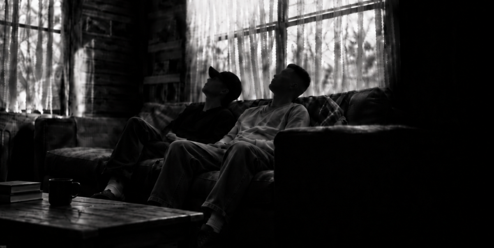

Estaba mirando el techo otra vez.

No tenía nada particularmente interesante.

Pintura blanca. Una sombra tenue de la luz que entraba por la ventana. Una pequeña grieta cerca de una esquina que había notado meses atrás y que tenía toda la intención de no arreglar nunca.

Aun así, algunas noches podía pasar veinte minutos mirándolo. Tal vez una hora.

El hombre sentado en el otro extremo del sofá cambió de posición.

Llevaba ahí el tiempo suficiente como para que el vaso que tenía en la mano estuviera casi vacío. Tenía una pierna apoyada despreocupadamente sobre la otra y la cabeza recostada contra el sofá. Durante los últimos minutos, él también había estado mirando el techo.

Tal vez estaba intentando entender qué era lo que yo veía ahí arriba.

*“Estás pensando en ella otra vez.”*

“No.”

*“Sí, claro.”*

“I'm thinking about the ceiling.”

He turned his head toward me.

*“¿Ahora el techo tiene nombre?”*

Lo miré.

“Dejame de joder.”

Volví a mirar hacia arriba.

Durante un rato, ninguno de los dos dijo nada.

Entonces:

*“¿Qué tiene de especial?”*

Suspiré.

“Siempre empezás por las preguntas fáciles.”

*“¿Es linda?”*

Lo miré.

Levantó una ceja.

*“¿Y?”*

Lo pensé un momento.

“Tiene una forma de responder las cosas.”

Esperó.

*“Eso no significa absolutamente nada.”*

“Ya sé.”

*“Entonces explicalo.”*

“Ewan ko.”

*“¿Qué?”*

“Quiero decir que no sé muy bien cómo explicarla.”

*“Intentá.”*

Me incorporé un poco.

“A veces digo alguna estupidez solo para molestarla. Y antes de que siquiera responda, ya sé lo que está haciendo.”

*“Nunca viste lo que está haciendo.”*

“Ya sé.”

*“Estás mirando palabras en una pantalla.”*

“Ya sé.”

*“No podés ver cómo reacciona alguien a través de un texto.”*

Lo miré durante un segundo.

“A veces sí puedo. A veces puedo verla sonreír a través de la pantalla.”

Se rió.

Yo no.

*“¿De verdad le dijiste eso?”*

“Sí.”

*“¿Y todavía te habla?”*

“De vez en cuando.”

Levantó las cejas.

*“Parece que hay una historia detrás de eso.”*

“Una larga.”

Se acomodó más profundamente en el sofá.

*“Tenemos tiempo.”*

---

Conocí a una chica en un juego.

No en la oficina.

No en el lugar de comida donde siempre pido.

No en una librería.

No porque algún amigo en común pensara que nos llevaríamos bien.

Nada de las formas normales.

Un juego para celular. Un puto juego para celular.

*“Romántico.”*

“Callate.”

*“Seguí.”*

Su nombre no era realmente Panterina, y el mío tampoco era realmente Francisco.

Esa era una de las cosas extrañas de ese lugar. Todos llegaban usando nombres que no eran los suyos. Pequeñas islas. Alianzas. Personas repartidas por todo el planeta, fingiendo durante unas horas al día que recolectar recursos y mandar pequeños ejércitos por un mapa congelado eran asuntos de importancia internacional.


En algún lugar dentro de todo eso estaba ella.

Al principio, era simplemente otro nombre en el chat. Después dejó de serlo.

*“¿Cómo?”*

“No sé.”

*“¿Otra vez?”*

“Ya te dije. Ese es el problema.”

Las cosas rara vez anuncian que están ocurriendo mientras ocurren.

No apareció ningún mensaje en mi pantalla diciendo:

**ADVERTENCIA: ESTA PERSONA ESTÁ A PUNTO DE CONVERTIRSE EN UN PROBLEMA. PROCEDA CON PRECAUCIÓN.**

Y si hubiera aparecido, probablemente igual habría apretado **Aceptar**.

*“Por lo menos sos consciente de lo que hacés.”*

“Apenas.”

Empezamos a hablar. O supongo que yo empecé a hablarle.

A veces durante unos minutos.

A veces durante horas.

A veces empezábamos hablando de absolutamente nada y, de alguna manera, terminábamos en algún lugar al que ninguno de los dos había planeado llegar.

Comida.

Sueño.

Países.

Estudios.

Trabajo.

Pelo.

Chistes estúpidos.

Cosas que habíamos hecho ese día.

Palabras en distintos idiomas.

Por qué *Ciao* aparentemente significaba lo que carajo ella quisiera que significara.


*“Ciao significa adiós.”*

“Ya sé.”

*“Y hola.”*

“Aparentemente.”

Se rió.

*“Ella te corrigió, ¿no?”*

“Sí. Tenía opiniones bastante fuertes al respecto.”

*“¿Y tenía razón?”*

“Eso no es relevante.”

Había otras cosas.

Una referencia a algo de lo que habíamos hablado semanas antes.

Un chiste estúpido que, de alguna manera, sobrevivía lo suficiente como para volver a aparecer.

Palabras capaces de traer una conversación entera del pasado de vuelta al presente.

Pequeñas referencias.

Cosas que probablemente parecían completamente normales para cualquier otra persona.

Y después estaba su inglés. Sonreí.

El hombre a mi lado se dio cuenta.

*“¿Qué?”*

“Solía molestarla por su inglés.”

*“¿Qué tan malo es?”*

“No voy a responder eso con sinceridad porque valoro seguir con vida.”

Se rió.

“Una vez le dije que su inglés era malo.”

*“Encantador.”*

“Creo que en algún momento estuve a punto de decirle que sonaba como una inmigrante, pero me contuve.”

Se quedó mirándome.

*“Ella es argentina.”*

“Ya sé.”

*“En Argentina.”*

“Sí.”


*“Y el inglés ni siquiera es su primer idioma.”*

“Soy consciente.”

*“Entonces estabas a punto de insultar su inglés mientras ella hablaba en tu idioma.”*

“Cuando lo explicás correctamente, hago que parezca un pelotudo.”

*“Lo dijiste vos, no yo.”*

“Tal vez eso la haga reír cuando lea esto.”

Se detuvo. Lentamente, giró la cabeza hacia mí.

*“¿Cuando lea esto?”*

Me quedé mirando el techo.

“¿Hmm?”

*“Dijiste ‘cuando lea esto’.”*

“¿Lo dije?”

*“Sí.”*

Siguió mirándome.

Sonreí.

“Tal vez por eso toda esta página está escrita en español, sin traducción al inglés.”

Hubo un breve silencio.

*“Esperá. ¿Qué?”*

“Nada.”

*“¿Estás escribiendo todo esto?”*

“No.”

*“Entonces, ¿por qué la página estaría en español?”*

“Para futuras discusiones.”

Se quedó mirándome un segundo más.

Después negó con la cabeza.

*“Sos un puto raro.”*

---

Había cosas sobre ella que empecé a recordar sin intentarlo.

San Juan. La siesta. De dos a cinco.

Una ciudad entera aparentemente capaz de decidir, colectivamente, que la tarde podía esperar.

También fui aprendiendo sobre sus estudios. Sobre enseñar.

Lo que le molestaba.

Lo que la hacía reír.

La forma en que podía decir algo completamente normal y, de alguna manera, yo seguir recordándolo días después.

Nada extraordinario. Esa era la parte difícil de explicar.

La gente espera razones proporcionales a lo que uno siente.

Si alguien se vuelve importante para vos, debería haber una historia igual de importante detrás.

Te salvó la vida.

Cruzó nadando un océano entero.

Atravesó una montaña entera para llegar a Chile.

Algo lo suficientemente enorme como para que cualquiera que escuchara la historia pudiera asentir y decir:

*Por supuesto.*

Pero a veces alguien se vuelve importante mientras te cuenta a qué hora duerme la siesta.

A veces es la forma en que responde una pregunta estúpida.

La forma en que dice hola.

El hecho de que quieras saber qué va a decir después.

*“Entonces es graciosa.”*

“Mucho.”

*“¿Inteligente?”*

“Sí.”

*“¿Interesante?”*

“Si no lo fuera, no seguiría mirando este puto techo.”

Sonrió.

*“Te olvidaste de hermosa.”*

“No me olvidé.”

---

Una vez le dije que se vería bien con rulos.

*“¿Sí?”*

“Sí.”

*“Entonces, ¿qué tiene de gracioso?”*

“En realidad, le mentí.”

*“¿Mentiste sobre su pelo?”*

“No. La mentira fue hacer parecer que el peinado importaba. Creo que se vería bien con casi cualquier cosa.”

Y hubo una foto nueva una vez también. Le dije que se veía linda. Que había sido una buena elección.

“Eso también fue mentira.”

*“¿La foto no se veía linda?”*

“No. Creo que se veía hermosa, pero decir ‘linda’ era más fácil.”

Me miró durante un segundo.

*“O sea que, básicamente, seguís mintiéndole a esta chica.”*

“Solo cuando la verdad suena como algo que podría meterme en problemas.”

---

En algún momento, me di cuenta de que ya no abría el juego por el juego en sí.

Lo abría para ver si ella estaba ahí.

Probablemente debería haberme preocupado antes por esa diferencia.

*“¿Qué sabías realmente de ella?”*

“Mucho.”

*“No. Quiero decir, ¿qué sabías de verdad?”*

“En realidad, no tanto. Pero aprovechaba cualquier oportunidad para conocerla un poco más.”

--- 

Ya había estado cerca de otras personas antes.

Había visto la atracción convertirse en apego, el apego convertirse en algo más grande, y había visto cómo eso más grande también terminaba eventualmente.

Ya había pasado por comienzos y finales.

Por esas horribles partes de en medio, cuando sabés que algo se está muriendo antes de que alguno de los dos tenga el valor de decirlo.

Con el tiempo, había visto cómo personas que alguna vez ocuparon la mitad de mis pensamientos se convertían en nombres que podía recordar sin sentir nada punzante.

Nada de esto era nuevo para mí.

Pero normalmente había pruebas.

Recuerdos que existían fuera de una pantalla.

Aprendías cómo se veía alguien recién despertado.

Qué tan rápido caminaba.

Qué hacía con las manos cuando estaba nervioso.

Si sentarse en silencio a su lado se sentía tranquilo o incómodo.

*“¿Y con ella?”*

“Casi nada.”

*“Nunca te sentaste frente a ella.”*

“No. Las posibilidades son astronómicamente bajas.”

*“Nunca caminaron por la misma calle.”*

“No.”

*“Nunca estuviste a su lado esperando que cambiara el semáforo para poder cruzar la calle.”*

“No.”

*“Nunca le tocaste la mano.”*

“No.”

*“No sabés cómo se ven los espacios entre sus dedos.”*

“No.”

*“No sabés cómo se siente su pelo.”*

“No.”

*“Qué tan rápido camina.”*

“No.”

*“Cómo suena su risa a un metro de distancia en vez de a través de un teléfono.”*

“Bueno, una vez sí escuché su risa, en un mensaje de voz.”

Apoyó la cabeza contra el respaldo del sofá.

*“Entonces explicámelo.”*

“¿Qué?”

*“¿Por qué ella?”*

Ahí estaba. Esa pregunta. Ya la había escuchado antes.

Una vez. O quizás dos.

¿Por qué alguien a quien nunca había conocido?

¿Por qué alguien que nunca había estado en el mismo lugar que yo?

¿Cómo podía alguien que nunca había caminado a mi lado por la misma calle tener tanto efecto sobre mí?

“Ewan ko.”

*“¿Otra vez?”*

“Estoy intentando encontrar una respuesta.”

*“¿Y?”*

“Y todas las respuestas suenan estúpidas.”

*“Probá conmigo.”*

Lo pensé.

Tal vez la respuesta más simple era que no me había encariñado con alguien que estaba parado a un metro de mí.

Me había encariñado con una presencia.

Una forma de pensar, ¿sabés? Una forma de responder.

Una persona que se había vuelto reconocible a través de la puntuación y los tiempos.

Aprendí cómo se veía su diversión sin verle la boca.

A veces podía darme cuenta de que estaba molesta sin verle los ojos, lo cual, sinceramente, es bastante estúpido.

A veces leía algo que había escrito y podía imaginar exactamente cómo lo habría dicho.

Tal vez a eso me refería cada vez que le decía que podía verla sonreír a través de la pantalla.

No literalmente.

Simplemente había empezado a reconocer dónde vivían las sonrisas entre sus palabras.

“Creo que esa es la parte que no puedo explicar”, dije.

*“¿Cuál?”*

“Hay tantas cosas sobre ella que no sé.”

*“Muchas, aparentemente.”*

“Exacto. Y, de alguna manera, las cosas que sí sé fueron suficientes.”

No respondió. Seguí hablando.

“No sé cómo sería caminar a su lado. Si hablaría todo el tiempo o si se quedaría en silencio. No sé esas cosas. Pero, de alguna manera, mi cabeza empezó a imaginarlas igual.”

*“¿Qué clase de cosas?”*

“Nada impresionante.”

*“¿Por ejemplo?”*

“Café.”

*“¿Eso es todo?”*

“Sentarnos en algún lugar, qué sé yo. Ella quejándose de algo. Yo molestándola a propósito. O tal vez ella molestándome a mí. Verle la cara justo antes de que diga algo sarcástico. Ya sabés, escucharla reír sin una pantalla entre nosotros.”

*“Cosas normales.”*

“Sí.”

*“Eso es peor.”*

“Lo es.”

*“¿Por qué?”*

“Porque las fantasías ridículas son fáciles de descartar.”

*“¿Y las normales?”*

Me quedé mirando el techo.

“Parecen posibles.”

---

Sin embargo, que algo fuera posible y que fuera realista no era lo mismo.

Lo sabía. Créeme.

Era plenamente consciente de la realidad de la situación.

Países. Distancia. Husos horarios. El momento. Las circunstancias.

Un océano de por medio: lo bastante grande como para tener su propio y maldito nombre.

Hay verdades que no se vuelven más ciertas solo porque las digas en voz alta.

---

Había distancia, y después estaba la *distancia*.

*¿Así que paraste un tiempo?*

“Ella me lo pidió.”

*“Esa no era la pregunta.”*

“Lo intenté.”

Borré el juego. Después, con el tiempo, lo instalé otra vez.

Después intenté no revisar. Y revisé.

Me decía que mañana pensaría menos en ella.

Pero el mañana nunca cooperaba.

Lo extraño de extrañar a alguien es que normalmente no se ve dramático.

Seguís trabajando. Seguís comiendo.

Salís.

Hablás con gente.

Corrés.

Andás en bicicleta.

Te reís.

Funcionás.

Y entonces pasa algo gracioso, y tenés una historia buenísima para contar.

*Me pregunto si ella—*

No.

El mundo sigue perfectamente bien.

---

Esas semanas sin ella no fueron catastróficas.

Simplemente fueron malas. Tres semanas malas.

Lo bastante largas como para empezar a acostumbrarme a la posibilidad de que tal vez nunca volviera a hablar realmente con ella.

Con el tiempo, volví al juego de verdad.

Y, mierda, un solo *“Hey you”* borró por completo esas tres semanas malas.

*“Estás sonriendo.”*

“No estaba sonriendo.”

*“Ahora mismo sí.”*

“Callate.”

*“¿Realmente borró las tres malas semanas?”*

“No literalmente.”

*“Entonces, ¿por qué decís ‘borró’?”*

“Porque durante unos cinco segundos olvidé por qué estaba intentando olvidarla.”

---

Cuando empezamos a hablar otra vez, aprendí las reglas.

O al menos lo intenté. Hablar con normalidad.

No convertir cada conversación en algo serio.

No hacer que cada chiste significara algo.

No confundir las cosas.

Si ella dice *amigo*, creerle a *amigo*.

Me miró de reojo.

*“¿Amigo?”*

“Sí.”

*“Odiás eso.”*

“No lo odio.”

*“Acabás de poner la cara que pone la gente después de morder un limón directamente.”*

“Entiendo lo que significa la palabra.”

*“Esa no era la pregunta.”*

En fin, aprendí a quedarme de mi lado.

*“¿De verdad podés hacer eso?”*

“Sí. Estoy aprendiendo.”

*“¿Y si la amistad es todo lo que alguna vez vas a tener?”*

“Entonces voy a ser su amigo. Voy a escuchar sus historias del día, de la semana.”

Bajé la mirada hacia mis manos y solté el aire.

“Y si la amistad es lo más cerca que alguna vez voy a poder estar de ella, voy a llevar ese título con orgullo.”

La habitación quedó en silencio. No era incómodo. Solo silencio.

*“¿Pero?”*

“No hay ningún pero.”

*“Siempre hay un pero.”*

Miré el techo.

“Pero alguna noche tranquila, cuando ella esté dormida y yo siga despierto al otro lado del mundo, probablemente todavía me pregunte cómo se supone que algo que se siente tan grande puede caber dentro de una palabra que suena tan pequeña.”

---

La segunda vez, las cosas fueron diferentes. Más seguras.

Supongo que los dos ya sabíamos dónde estaban los límites. Ewan ko.

Así que hablábamos. A veces unos minutos. A veces unas horas.

En algún momento, alguno de los dos decía buenas noches.

Y diez minutos después, seguíamos hablando.

Buenas noches otra vez.

Otro tema.

Otro chiste.

En algún momento, *buenas noches* dejó de funcionar como una despedida y pasó a ser más bien una recomendación.

Creo que hubo conversaciones en las que ella intentó terminar de hablar tres veces y, de alguna manera, seguimos después de cada una.

Me gustaban esas noches más de lo que admitía.

---

Me fui unos días a otro lugar.

Calles distintas. Edificios distintos. Comida distinta.

Recuerdo estar en el avión, mirando un paisaje diferente.

Pero, de alguna manera, una parte de mí seguía deseando ver otro.

*“Entonces ya estás bien.”*

“¿Escuchaste algo de lo que acabo de decir?”

---

*“Tengo otra pregunta.”*

“No.”

*“Ni siquiera sabés cuál es.”*

“La respuesta sigue siendo no.”

*“¿Y si la hubieras conocido en un momento mejor?”*

Mi pulgar se quedó quieto sobre el teléfono. No respondí.

*“Pensaste en eso.”*

“Claro que pensé en eso.”

*“¿Más cerca?”*

“Tal vez.”

*“¿Antes?”*

“Tal vez.”

*“¿En otras circunstancias?”*

Lo miré.

“Sí.”

Asintió.

*“¿Y entonces?”*

Apoyé la cabeza hacia atrás.

“Odio no haberla conocido en un momento mejor.”

La frase quedó suspendida ahí. La había pensado muchas veces.

Decirla en voz alta se sintió diferente.

No porque me arrepintiera de haberla conocido.

Todo lo contrario.

Odiaba el momento porque conocerla me había dado apenas lo suficiente como para preguntarme cómo podría haber sido todo lo demás.

“¿Qué significa siquiera ‘un momento mejor’?”, dije.

*“¿Me lo estás preguntando a mí?”*

“No.”

Tal vez un momento mejor significaba no necesitar reglas.

No tener que medir cuánta calidez podía caber de forma segura dentro de un mensaje.

No tener que tomar algo enorme y buscar una palabra más pequeña para nombrarlo.

Tal vez existía otra versión de la realidad en la que el Pacífico no se interponía entre dos tardes cualquiera.

Tal vez podría haber descubierto todas esas cosas que no sabía.

Tal vez podría haber aprendido cómo se sienten los espacios entre sus dedos, en vez de limitarme a preguntármelo.

*“¿Acabás de mirar tus manos?”*

“No.”

*“¿Y si ella hubiera estado con vos?”*

Lo pensé por un momento.

“Intentaría hacerla feliz.”

*“¿Intentarías?”*

“No soy tan arrogante como para prometerle felicidad a otro ser humano.”

*“Pero lo intentarías.”*

“Cada puto día.”

Se quedó en silencio.

*“¿Se lo dirías?”*

“No.”

*“¿Por qué?”*

“Porque no vivimos en esa realidad.”

---

Me miró.

*“Entonces aceptás las reglas.”*

“Estoy aprendiendo.”

*“Hay un montón de reglas en esta historia.”*

“Por eso necesitamos una categoría.”

*“¿Una categoría?”*

“Para este tema.”

Se rió.

*“¿Qué, como las minutas de una reunión?”*

“Exactamente.”

*“¿Tareas pendientes?”*

“Asuntos pendientes.”

*“Para futuras discusiones.”*

Golpeé suavemente el teléfono contra el costado del sofá.

“Para futuras discusiones.”

Me miró raro.

*“Eso suena como algo que vas a poner en la historia.”*

Me quedé mirando al frente.

“¿Qué historia?”

*“La que aparentemente está siendo traducida al español para una persona muy específica.”*

“No sé de qué estás hablando.”

*“¿Ella ya sabe que está leyendo sobre sí misma?”*

Eso me agarró desprevenido. Lo miré.

“Probablemente.”

*“¿Probablemente?”*

“Es inteligente.”

*“¿Y si todavía no se dio cuenta?”*

Sonreí.

“Ahora ya sí.”

---

La habitación volvió a quedar en silencio.

Entonces preguntó:

*“Si pudieras decirle algo sin absolutamente ninguna consecuencia, ¿qué le dirías?”*

“Esa es una pregunta terrible.”

*“¿Por qué?”*

“Porque las consecuencias forman parte de la realidad.”

*“Solo decíselo.”*

Bueno, había demasiadas respuestas.

Le diría que aprendí las reglas porque quería seguir hablando con ella más de lo que quería seguir discutiendo con la realidad.

Le diría que aceptaría *amigo* si esa era la palabra con la que ella se sentía cómoda.

Le diría que me gustan sus chistes, por más malos que sean.

Le diría que me gusta saber información completamente innecesaria sobre su día, porque la información nunca fue lo importante.

Ella lo era.

Le diría que ella es febrero.

Y tal vez le diría la única cosa de la que estaba completamente seguro.

“Me alegra que exista.”

*“Esa es una frase rara.”*

“Ya sé.”

*“Todo el mundo existe.”*

“No me refiero a eso.”

Me costaba explicarlo.

“Quiero decir…”

Hay miles de millones de personas vivas.

La mayoría pasa por el mundo sin llegar nunca a volverse real para nosotros de manera individual.

Nombres. Caras. Desconocidos entre la multitud.

Personas viviendo vidas enteras y complicadas en algún otro lugar, de las que nunca vamos a saber absolutamente nada.

Y entonces, muy de vez en cuando, una de ellas cruza esa frontera invisible que separa a *alguien en el mundo* de *alguien en tu mundo*.

---

Mi teléfono se iluminó.

Ninguno de los dos se movió durante un segundo.

Entonces me miró.

*“¿Ella?”*

Su nombre estaba ahí.

*“¿Qué vas a decir?”*

“Ewan ko.”

*“Parece que esa es tu respuesta para todo.”*

Toqué el campo de texto.

Escribí:

**Hello.**

Lo miré. Lo borré.

Escribí:

**¡Hola!**

También lo borré.

Volví a escribir:

**¿Todo bien?**

Se rió.

*“Gastaste una cantidad increíble de energía emocional en un saludo.”*

“No lo entenderías.”

*“Aparentemente nadie entiende esta historia excepto vos.”*

“Y quizás una persona más.”

Pensé en lo que realmente quería escribir.

Podía decir:

**Me alegra que estés acá.**

Lo bastante seguro. Podía preguntarle cómo había estado su día.

Normal.


Podía decirle alguna estupidez.

Probablemente lo mejor.

O podía volcar en la pantalla todo lo que acababa de decir.

El hecho de que no solo me alegraba haberla conocido.

Me alegraba simplemente que existiera.

*“Escribí eso.”*

“No.”

*“¿Por qué?”*

“Porque esto es un chat de un juego, no una nota de suicidio.”

*“Dramático.”*

“Además, el filtro censuraría la mitad.”

*“Tal vez sea más seguro así.”*

Me quedé mirando el campo de texto vacío.

Se inclinó un poco hacia mí.

*“¿Qué dirías si no hubiera reglas?”*

Escribí. Despacio.

Lo leí y después lo borré.

Volví a escribir. Después lo borré.

Escribí otra cosa.

Me detuve. Este borrador duró un poco más. Después también lo borré.

Finalmente:

**¿Cómo estuvo tu día?**

*“¿Eso es todo?”*

Se me quedó mirando.

“Eso es todo.”

*“¿Después de todo eso?”*

Apreté enviar.

Pasaron unos minutos. Entonces apareció su respuesta.

*“¿Dijo algo gracioso?”*

“No.”

*“¿Algo tierno?”*

“No.”

*“Entonces, ¿por qué estás sonriendo?”*

“No lo entenderías.”


Mis dedos volvieron a quedarse suspendidos sobre el teléfono.

Escribí.

Algo que no enviaría. No porque no fuera verdad.

Lo borré.

*“¿Otra vez?”*

“Hay cosas que es mejor dejar sin escribir.”

*“Literalmente te pasaste toda la noche hablándome de ella.”*

Miré su nombre una última vez.

“Bueno. Voy a contárselo todo, solo por esta vez.”

*“Por fin.”*

Abrí el chat una vez más y escribí.

```
Una p***e de mí desearía poder v****r a***s y evitar que tuviéramos esa c**********n, y simplemente mantener todo n****l entre nosotros. Pero ya es demasiado tarde para eso. Ya te dije la v****d.

Sentía c***s por vos, y t*****a las s****o.

Me seguís preguntando por qué me g****s, o por qué tenías que ser v*s. Pero podrías preguntármelo mañana, la semana que viene o el año que viene, y probablemente seguiría sin tener una r*******a.

En algún momento, entre nuestra primera c**********n y todos esos pequeños m******s que vinieron después, te c*********e en uno de mis p**********s f*******s.

Cuando me d*******o. En las c*******s que escucho. En los a*********s que desearía que pudieras ver. Y en esos momentos tranquilos antes de quedarme d*****o.

No sé exactamente cuándo p**ó.

Solo sé que, de alguna manera, p****r en v*s se convirtió en una de esas pequeñas cosas que hacen que la v**a se sienta un poco más h*****a.

Y, sinceramente, una p***e de mí espera que nunca d*********a del todo.
```