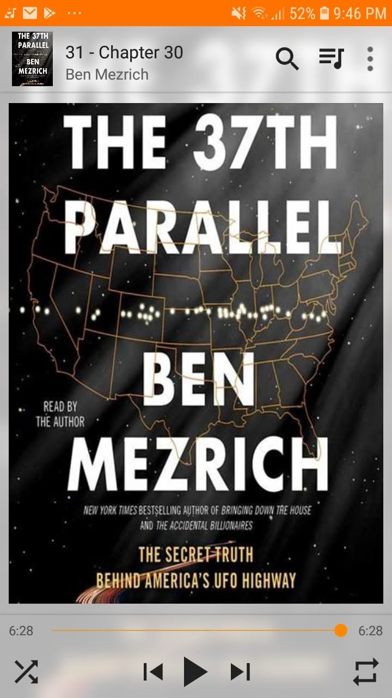

*"Perhaps, there might be actually life outside of our perspective."*

Book 71 of 100

Just the right non-fiction to wrap up the month.

My second read from Ben Mezrich, and he keeps that signature fast-paced storytelling going. 

This one follows a Colorado sheriff's deputy investigating bizarre cattle mutilations and UFO sightings, connecting the dots straight across a single line of latitude spanning America.

Whether you buy into the extraterrestrial theories or stay skeptical, it is an entertaining dive into unexplained phenomena and government secrecy.

Next up: *Animal Farm*.

29 more to go to reach the 100th mark, and only 2 months left until the 365th day!