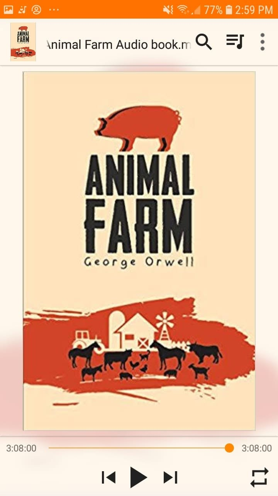

*"All animals are equal, but some animals are more equal than others."*

After several stalled attempts to get through *1984*, I decided to pick up another piece of George Orwell's work instead.

Humans corrupting other humans. Using barnyard animals to mirror human society and political rot was pure genius. 

It starts with good intentions and idealistic revolutions, only to end right back where it began under the boot of a new ruling class. The way language slowly gets rewritten to justify hypocrisy hits a bit too close to home.

It might be styled as a simple fable, but it is undeniably powerful.

A great start for the month.