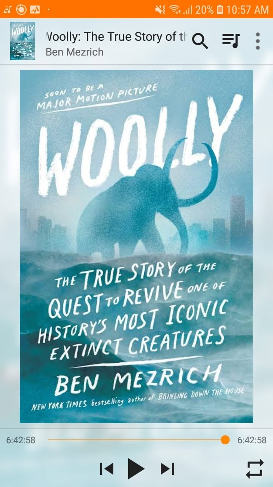

*"We never stop hunting. We are the predator."*

Starting the week with elephants and ancient giants.

It is eye-opening to learn how these massive species thrived for millennia before humans showed up, and how quickly we pushed them straight toward extinction once we did.

The book follows a team of geneticists trying to do the reverse: resurrect the woolly mammoth using CRISPR to edit cold-resistant genes into Asian elephant DNA. The idea of de-extinction to restore the Siberian tundra sounds like pure sci-fi, but the science behind it is very real.

Another fast, wild read in the Ben Mezrich marathon.