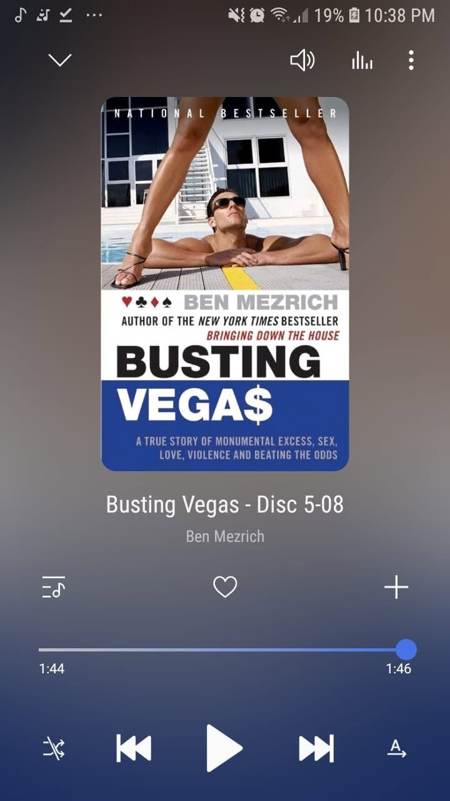

*"Move the odds in your favor."*

If there is one main takeaway from this read, that is to move the odds in your favor.

Another fast-paced, entertaining story about MIT math geniuses beating the casinos at their own game. 

It dives past basic card counting into card steering, shuffle tracking, and exploiting physical dealer tells across European tables.

It reads more like a heist thriller than a non-fiction book. 

At the end of the day, it is all about finding a tiny statistical edge in a system built to make you lose, and having the discipline to push it relentlessly.

Another fun one down in the Ben Mezrich marathon.