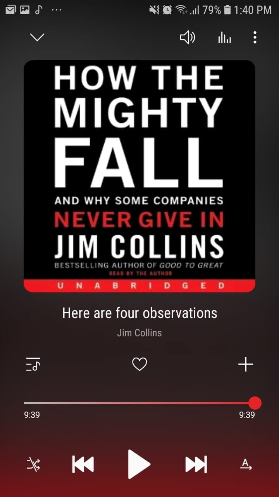

*"The mighty can fall, but often they rise again."*

Felt like a condensed companion to Chunka Mui's *Billion Dollar Lessons*, but it definitely stands on its own.

So how does a good-to-great company actually spiral down?

The author breaks the decline into clear stages, starting from hubris born of success down to grasping for salvation and capitulation. It shows how failure rarely happens overnight. It actually starts subtly when leaders get arrogant and lose discipline.

Fairly short and fairly useful. 

And yeah, my fourth listen from Jim Collins!