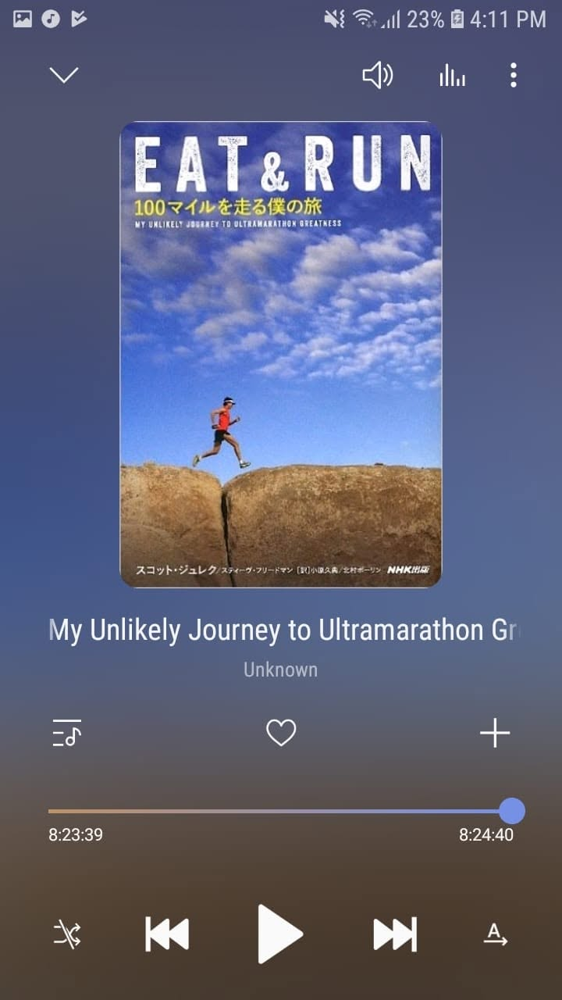

*"Strength doesn't come from physical capacity, it comes from an indomitable will."*

A great finish right before stepping into next week's new chapter.

Scott Jurek's story is pure grit. 

Running 100-mile trails on a 100% plant-based diet sounds impossible to most people until you see how meticulously he breaks down nutrition, recovery, and mental stamina. It is as much about discipline and mindset as it is about putting one foot in front of the other for 24 hours straight.

When your legs want to give up, it really just comes down to whether your mind refuses to quit.

Definitely one of the best reads of 2018.