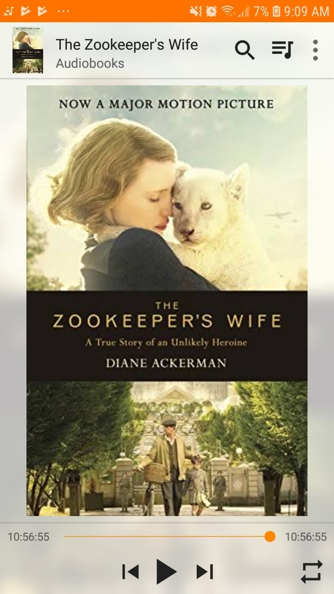

*"How do you retain a spirit of affection and humor in a crazed, homicidal, and unpredictable society?"*

First read for December, and 79th for the year!

This had so much potential to tell the incredible, untold true story of the Zabinskis. 

Hiding hundreds of people inside the Warsaw Zoo right under the noses of the Nazis is such an insane, heroic premise.

I think it just fell short on the writing style. 

The pacing felt a bit misaligned with the gravity of what was happening, almost too detached or flowery when the story itself needed raw grit. 

Still, I think the history behind it and what that family pulled off is undeniably remarkable.