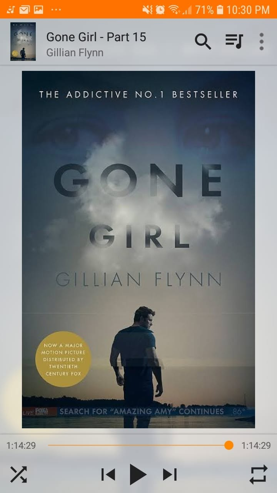

After a lot of life changes and busy days, I was finally able to get back and finish the last part of this audiobook.

I must say, this one lives up to the hype of being addictive and thrilling. But man, that ending really leaves you with a bitter taste in your mouth.

So naturally, I watched the movie right after.

It was pretty good too. I was actually expecting some major deviations near the end, since film adaptations usually change things up. But for the most part, it just condensed a few scenes.

Overall, it is a solid story.

When you really think about it, the dark humor here is that it almost mirrors how marriage works. 

No matter how dysfunctional and toxic things get, you stay locked in with your partner. 

You sort through the mess, even if the mess is completely insane.