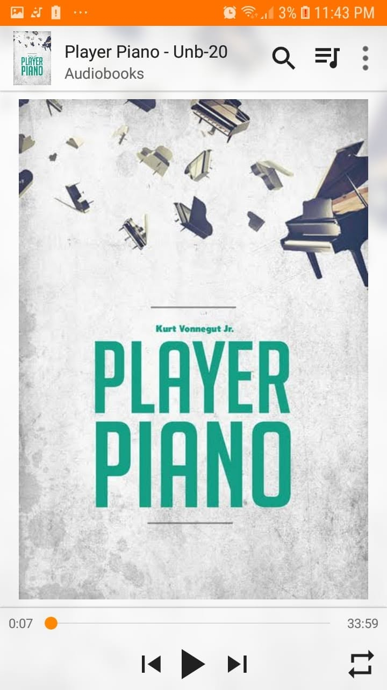

*"Not a book of what was, but a book of what could be."*

For a satire written more than five decades ago, this eerily mirrors how much we rely on technology today. 

In our generation's case, it feels uncomfortably close to *Black Mirror*. 

Machines taking over human purpose, automation running everything, and people left wondering where they actually fit in.

The ideas feel a bit scattered at times, but it still challenges your perspective.

Just like that eerie chill you get right after watching a good *Black Mirror* episode, this one leaves you sitting with a lingering question:

*What comes next?*