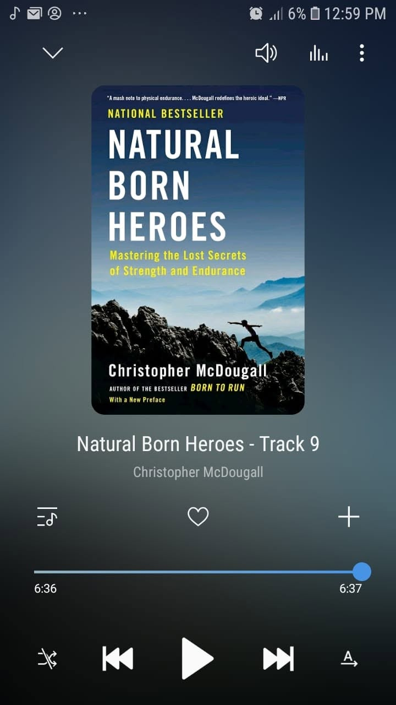

*"Heroes, after all, aren't measured by the stories they told, but by the stories told about them."*

Book 83 of 100

83rd on 365th.

Last read for 2018. 

A lot of learnings and a lot of fresh perspectives packed into this one. 

It blends World War II history, kidnapping a Nazi general in Crete, and the forgotten physical skills of ancient endurance athletes and resistance fighters. 

Parkour, natural movement, fascial elasticity, and burning fat for fuel instead of relying on pure carbs. 

It really rethinks what human endurance and strength are supposed to look like.

I came up short by 17 reads to hit the 100 mark, pero it is still okay. 

83 books in a single year is still a solid run.

Setting up a new list for the coming year. 

Anotha one!