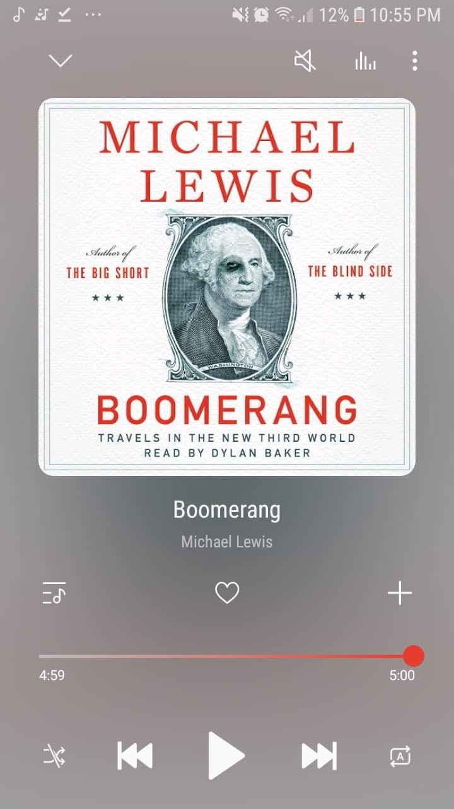

*"If we refuse to regulate ourselves, the only regulators will be our environment."*

Book 1 of 100

First book of the year. 

This is actually my second one from Michael Lewis, and I'm already finding his work pretty stimulating. Honestly, all of his books seem better suited for print rather than audio because of how dense the details get.

The guy is definitely a master at explaining finance. 

The book takes you on a wild tour of different countries struck by the 2008 financial crisis, from Iceland and Greece to Ireland and even parts of the US. 

What makes it wild is how the book shows that cheap credit didn't just break the economy. It exposed the quirks and flaws of each country's culture. Once the money became free, people everywhere just went a little crazy in their own unique way.

Really fascinating read on what happens when human nature meets easy debt.