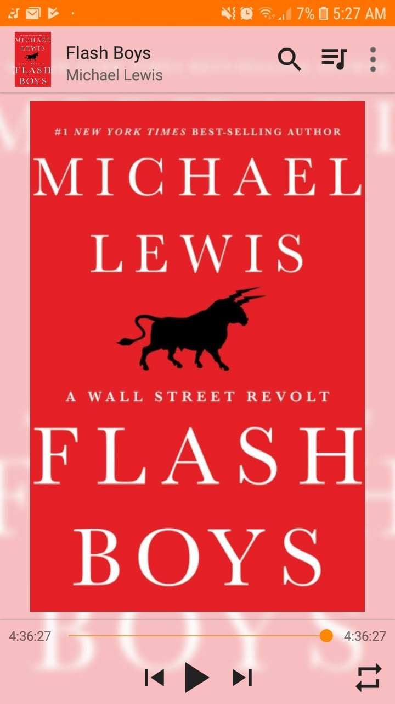

*"An endless quest by human beings to gain a certain edge in an uncertain world."*

Book 2 of 100

Honestly, this one is probably best understood in print. 

Like most of his work, it digs into how the public market actually works behind closed doors. 

Controlled by a tiny circle, and completely invisible to almost everyone else.

People were literally tunneling fiber optic cables straight through mountains just to shave off three milliseconds.

It is crazy to realize how much of the stock market isn't about investing at all. It is just an engineering arms race. 

Who has the shortest wire, who sits closest to the servers, and who can jump in front of an order a fraction of a microsecond faster.

Working with infrastructure myself, seeing how latency can make or break billions of dollars was both cool and slightly terrifying.

Will be following this with one last piece from Michael Lewis.

After that, I'll probably jump to something a lot lighter.