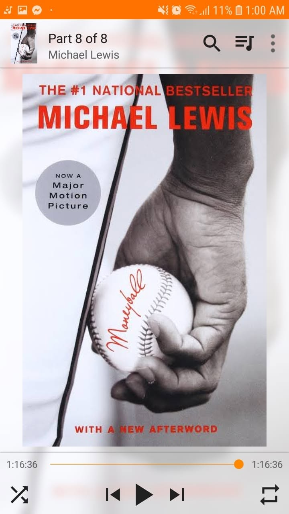

*"If you challenge conventional wisdom, you will find ways to do things much better than they are currently done."*

3/100

Just finished listening to Moneyball.

To be honest, it felt like three things wrapped into one:

- A biography
- A baseball crash course
- A historical account of one of the most infamous GMs in sports history

I am not even a baseball fan, but what really hooked me was the problem-solving side of it all.

So, these were the variables: 

- The Oakland Athletics were running on a shoestring budget.
- They were up against giants who could outspend them three times over.
- If you play the exact same game as the big teams with only a fraction of their money, you lose.

So what do you do?

- You stop trusting "the way it has always been done."
- You throw out old scout biases.
- And you look at the actual data.

Traditional scouts looked for guys who just looked like athletes. But the real game was finding undervalued guys who simply knew how to get on base. Walks and on-base percentage weren't flashy, but they won games.

(I hadn't heard about these terms before reading the book, but they were interesting enough that I ended up googling baseball basics.)

It made me think about how easy it is to lean on conventional wisdom because it feels safe. We stick to traditional playbooks and assume everyone else must be right.

When resources are tight, sticking to the standard mold will run you into the ground.

Sometimes you have to step back, and ask better questions.

You know, find the real signal through the noise.

----------------------------------------------

I haven't yet watched the film adaptation, but I'm eager to see how the main protagonist is portrayed and which characters make the cut.

Will be the last audio from Michael Lewis for now.

Next up: *Ready Player One*.