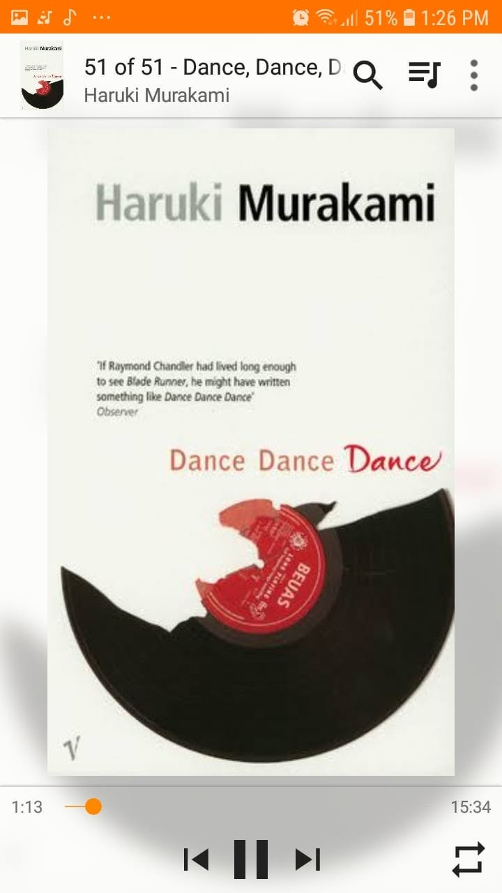

# Libro: Dance, Dance, Dance 

*Dance, Dance, Dance* by Haruki Murakami

Book 5 of 100

“Time solves most things. And what time can’t solve, you solve for yourself.”

Dansu, dansu, dansu.

A story about losing people, searching for meaning, and somehow continuing even when you’re not completely sure where life is taking you.

People disappear.

Relationships change.

Some things never get properly explained.

And yet, life keeps playing its music.

Maybe that’s the point.

You don’t always get to choose the song. You don’t always understand the rhythm, and sometimes you completely lose the beat.

But you keep moving anyway.

One step after another.

With every beat that life plays, all you really have to do is dance.

**Dance, dance, dance.**
