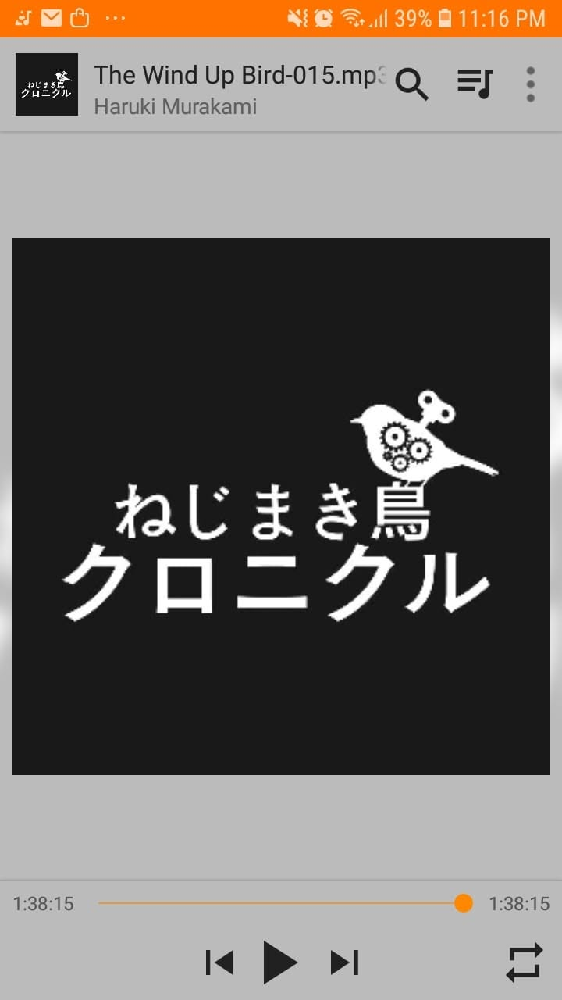

# Libro: The Wind-Up Bird Chronicle 

*The Wind-Up Bird Chronicle* by Haruki Murakami

Book 6 of 100

“A person’s destiny is something you look back at after it has passed, not something you see in advance.”

This one is honestly difficult to describe because of the way the story unfolds.

It starts off relatively grounded, but somewhere along the way, things become stranger, darker, and more disconnected.

And midway through, you start asking yourself:

**Where the hell is this story actually going?** 

Characters appear with their own histories. Strange events happen without much explanation. Different timelines, memories, dreams, and realities start overlapping until you’re not even completely sure which parts are supposed to connect.

Still, I couldn’t shake the feeling that some of these characters belonged to an even bigger world, like maybe pieces of their stories were hiding somewhere in Murakami’s other books.

Maybe they are.

Maybe they aren’t.

At this point, I’m starting to accept that Murakami probably isn’t going to explain everything to me anyway. 

But if there’s one book so far that feels like an entire maze of complicated, interconnected stories packed between two covers, this is definitely it.

You keep following the turns, hoping everything will eventually make sense.

Then somehow, even when it doesn’t completely, you still find yourself thinking about it afterward.
