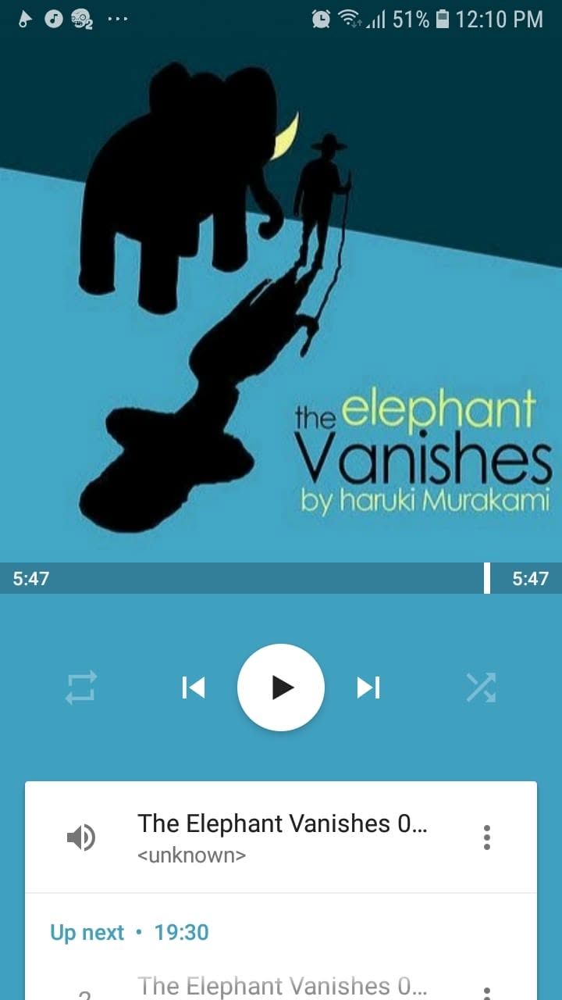

# Libro: The Elephant Vanishes

Book 8 of 100

“People who go through heavy experiences like that are changed men. They change for the better or they change for the worse. On the good side, they become unshakeable.”

Damn. Going through Murakami’s books sometimes feels a lot like going through life itself.

There are parts you enjoy immediately, and then there are parts that feel completely irrelevant while you’re in the middle of them. With *The Elephant Vanishes*, I honestly didn’t start appreciating some of the stories until I was already near the end.

And yeah, I guess that’s pretty much how life works too.

You grow up and encounter all sorts of trivial things that don’t seem to matter at the time.

You meet people once and never see them again.

You get tired.

You lose sleep.

You start carrying memories you wish you could forget.

And, apparently, if you’re living inside a Murakami story, you might also dance with dwarfs or hear someone banging on your window.

You’ll have to read *The Elephant Vanishes* for that one.

A lot of these moments can feel disconnected. Some of them might not even seem important when they happen.

But eventually, when you reach that last mile and look back, you realize that maybe not everything needed to have an obvious purpose.

Some things simply became part of you.

The people.

The strange moments.

The mistakes.

The things that made sense and the ones that absolutely didn’t.

Separate pieces at the time.

Part of the whole when you look back.
