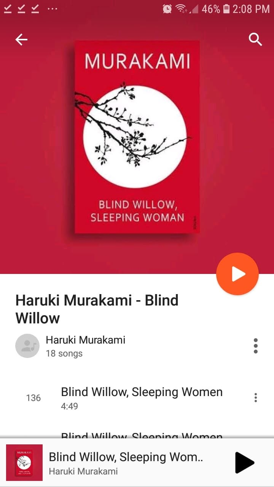

# Libro: Blind Willow, Sleeping Woman

*Blind Willow, Sleeping Woman* by Haruki Murakami

Book 9 of 100 

“Ordinary imperfect people always choose similarly imperfect people as friends.”

A strange mix of the ordinary, the different, and the surreal.

Since this is a collection of short stories, every few pages feels like stepping into a completely different little world. Some stories feel grounded and familiar, while others slowly drift into something weird, dreamlike, or slightly unsettling.

And somehow, that seems to be where Murakami is most comfortable.

You meet ordinary people dealing with loneliness, relationships, memories, strange encounters, and sometimes things that don’t really make sense at all.

Some stories left me thinking.

Some left me confused.

And some just ended before I could even figure out what exactly I was supposed to feel. 

But I guess that’s part of the charm.

**Ganbatte, Murakami-san!** 
