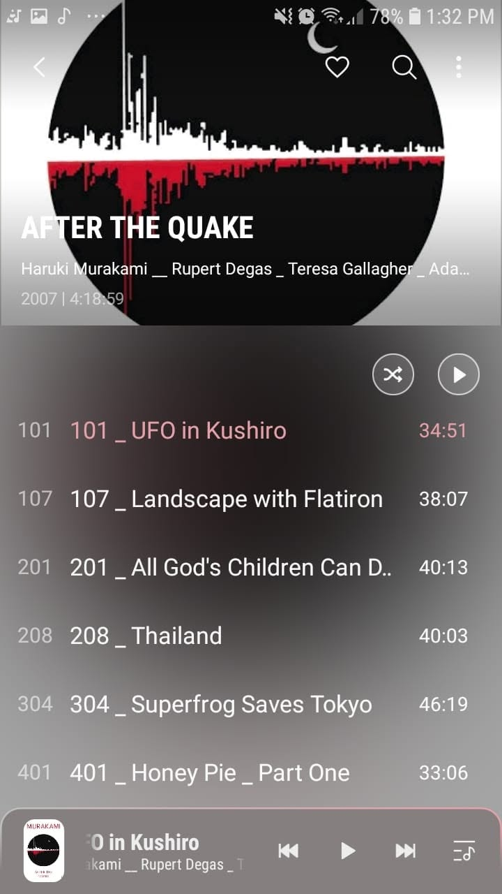

# Libro: After the Quake 

Book 13 of 100 

“I want to write about people who dream and wait for the night to end; who long for the light so they can hold on to the ones they love.”

And that pretty much ends my journey through Murakami’s works. 

There are still a few of his books that I haven’t downloaded or listened to, but after going through this many, I feel like I’ve gotten a pretty good sense of the man behind the stories.

A few observations:

1. He likes to smoke.
2. He likes pussies. Cats, I mean. Cats. His protagonists almost always seem to have one, lose one, look for one, or know someone who has one.
3. He has clearly lived enough life to have a ridiculous amount of strange material to pull from.

His style definitely isn’t the conventional kind most of us are used to.

There isn’t always a captivating plot pushing you from one chapter to the next. Not every “why” gets answered. Loose ends don’t always get tied neatly together, and sometimes entire storylines seem to appear, intersect with everything else, and then disappear without giving you the closure you were expecting.

And yes, that can be frustrating.

But I think that’s also part of what makes his stories interesting.

Murakami leaves a lot of space for the reader to decide what things mean, how they see the characters, and whether any of those strange little experiences actually mattered at all.

And when you think about it, real life works a little like that too.

Not everything that happens to us has some grand meaning.

A lot of it is just noise.

Random encounters. Strange conversations. People who disappear from our lives. Things we worried about for weeks that eventually meant absolutely nothing.

Most of what we experience probably ends up becoming small trivialities somewhere in the larger story.

So maybe the choice is whether we spend our lives obsessing over every little thing that didn’t make sense, or simply accept that not everything needs an explanation and keep moving.

You can’t always decide where the current flows.

But you can decide what to pack into your ship.
