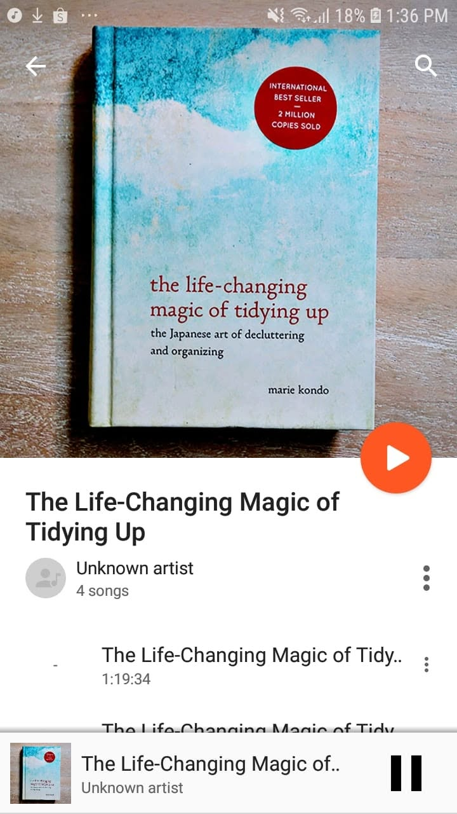

# Libro: The Life-Changing Magic of Tidying Up

*The Life-Changing Magic of Tidying Up*, by Marie Kondo

“People cannot change their habits without first changing their way of thinking.”

Now I understand the fuss around Kondo’s Netflix series.

Although, after reading the book, I think there’s a lot more to the idea than what usually gets reduced online to:

**Does it spark joy?**

And no, the answer is probably not to start throwing away things, or family members for that matter, just because they don’t. 

The book is really more about changing how you think about the things you own, why you keep them, and what kind of space you actually want to live in.

A few takeaways that stood out to me:

1. **Start by knowing what you actually own.**

    Objects can be counted.

    Sometimes that alone is enough to make you realize how much stuff you’ve accumulated without even noticing.

2. **The urge to clean is sometimes about something else entirely.**

    People often suddenly feel like tidying up when they’re under pressure.

    Not necessarily because the room desperately needs cleaning, but because there’s something else in life they’re struggling to put in order.

    Cleaning gives you something visible that you can control.

3. **A clean room doesn’t automatically mean a clear mind.**

    Tidying your physical space can give temporary relief.

    But if you let that feeling convince you that everything is suddenly fine, you might never deal with whatever psychological clutter was bothering you in the first place.

4. **Visible mess can distract us from the actual problem.**

    Sometimes clutter is only the symptom.

    You can move things around, hide them in drawers, buy another storage box, and make everything look organized.

    But that doesn’t necessarily mean the problem has been solved.

    Sometimes you’ve just created a nicer-looking version of the same mess.

5. **Storage is not the same as tidying.**

    Putting things away can create the illusion that the clutter is gone.

    Then the drawers fill up.

    The shelves fill up.

    The storage boxes fill up.

    And eventually the room is overflowing again.

6. **Sort by category, not by location.**

    Instead of cleaning one room at a time, gather similar things together.

    Clothes.

    Books.

    Documents.

    Random stuff you somehow forgot you owned.

    Seeing everything in one place forces you to confront just how much of it there actually is.

7. **Treat tidying as an event, not an endless daily battle.**

    Do the hard sorting once.

    Make the decisions.

    Then maintaining the space becomes much easier afterward.

8. **Discard first. Organize second.**

    There’s not much point in finding the perfect storage system for things you don’t even need.

    Decide what stays first.

    Then figure out where everything belongs.

9. **Know what kind of life you’re trying to build.**

    Don’t tidy just because the room looks messy.

    Visualize the destination.

    What do you want your space to feel like?

    Why do you want to live that way?

    That part probably matters more than which drawer your socks go into.

10. **And finally, examine what you own.**

    Does it still matter to you?

    Does it serve a purpose?

    Does it, as Kondo puts it, **spark joy?**

If you think about it, there’s actually some overlap here with Lean thinking and, more generally, the idea of removing waste and keeping only what adds value.

And maybe that’s why the book works beyond just cleaning.

It’s not really about throwing things away.

It’s about becoming more deliberate about what deserves space in your life.

So yeah.

Great read.

Great guide.

But ultimately, each of us still has to decide what is important and what is simply noise.

In the end, maybe the better question isn’t: **What should I get rid of?**

Maybe it’s: **What is actually worth keeping?**

Keep the things that still speak to your heart.
