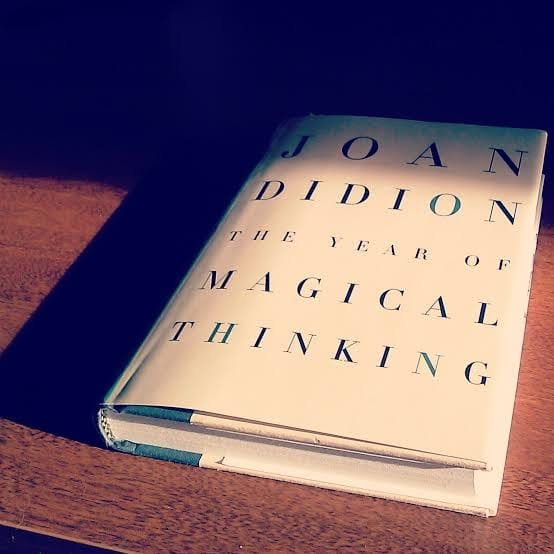

# Libro: The Year of Magical Thinking

Book 15 of 100

“Grief turns out to be a place none of us know until we reach it.”

Damn. Such a depressing read.

It’s about losing someone and what that loss does to the people left behind. And even while reading through all of that grief, I still found myself hoping there would be some sort of silver lining waiting on the very last page.

There really wasn’t.

But there’s still so much courage contained between its covers.

Maybe not the kind that magically makes everything better, but the kind that lets you keep going even when things won’t ever be the same again.

Cry.

Accept.

Move forward. 
