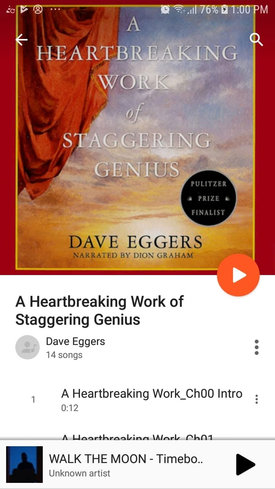

*A Heartbreaking Work of Staggering Genius*, by Dave Eggers

Book 16 of 100

“I think if you’re not self-obsessed, you’re probably boring.”

Damn.

This was such an emotionally exhausting read.

At times it feels funny, chaotic, self-aware, depressing, absurd, and deeply personal all at once.

Some people will probably love that style.

Others will absolutely hate it.

There are moments when Eggers seems to be telling you a story, then suddenly steps outside of it, comments on the fact that he’s telling you a story, questions his own motives, and somehow drags you along with him anyway.

It can get messy.

But there are also a lot of interesting thoughts buried between all that chaos, especially around grief, responsibility, growing up too quickly, and the strange ways people try to make sense of difficult experiences.

Not my favorite Dave Eggers read.

But definitely memorable in its own weird way. 

Still looking forward to checking out more of his work. 
