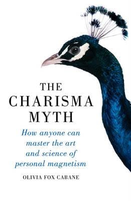

# Libro: The Charisma Myth

*The Charisma Myth*, by Olivia Fox Cabane
Book 17 of 100

“Speak like you’re sharing a secret.”

For leaders, managers, speakers, or really anyone who wants to communicate better, this one is worth checking out.

One of the more interesting ideas in the book is that charisma isn’t necessarily something you’re born with.

It can be practiced.

The way you listen.

The way you carry yourself.

The way you make someone feel like they actually have your attention.

A lot of it comes down to presence, warmth, and confidence.

And I think that’s what makes the concept useful.

You don’t have to become the loudest person in the room.

You don’t need some larger-than-life personality.

Sometimes being charismatic simply means being fully present, knowing when to speak, and making people feel like the conversation actually matters.

If you’re a fan of Dale Carnegie and books about communication and influence, this is definitely something worth diving into. 

After spending some time relaxing with narratives and fiction, I’m back to business and self-development reads.

So yeah.

Fresh mind.

Fresh perspective. 
