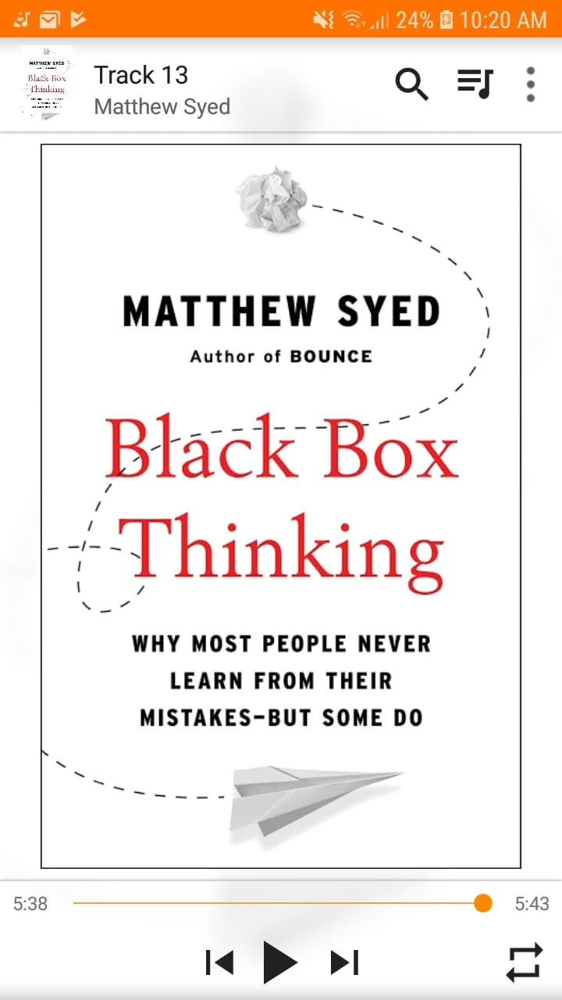

# Libro: The Black Box of Thinking 

Book 19 of 100.

**Main Takeaways:**

1. It’s very easy to sit back and come up with grand theories about how to change the world, but more often than not, our intuitions are wrong.

2. Most of the time, we’re so worried about messing up that we never even get onto the field and try.

3. Ultimately, we have to remember that success is only the tip of the iceberg. Beneath the surface, outside our view and often outside our awareness, is a mountain of necessary failures that came before it.

I know there are a lot more ideas laid out in the case studies throughout this book, but these three were the ones that really stuck with me.

They were also the only ones I actually managed to write down while listening halfway through. Haha.

As the book puts it, the world is far too complex to be figured out from your armchair.

Go out.

Test your ideas.

Be wrong. Learn. Fail again. Try again.

And maybe, after you’ve tried everything humanly possible, there comes a point when you can finally say:

**“This time, I know it’s right.”** 

So yeah.

Learn from your own mistakes, but learn from other people’s mistakes too.

As Levenson puts it:

**“Learn from the mistakes of others. You can’t possibly live long enough to make them all yourself.”**
