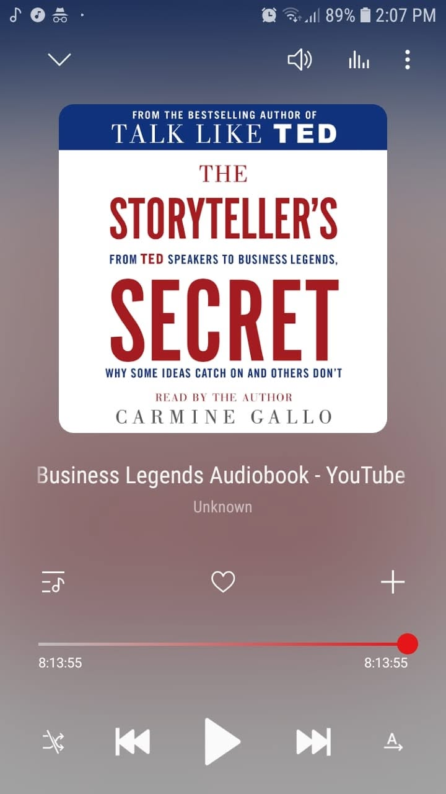

# Libro: The Storyteller's Secret

*The Storyteller’s Secret*, by Carmine Gallo
Book 20 of 100

“In the end, you’re never going to be certain that you’re on the right path. You just have to listen to the call and trust that it will all work out.

The path isn’t clearly laid out.

You’ll be guided, but if you don’t start walking, you won’t get anywhere.

Start walking even if you don’t know where the path will lead you.”

What I liked about this one is how it reminds you that people rarely remember information just because it was presented clearly.

They remember how it made them feel.

They remember the person behind it.

They remember the story.

That’s probably why the best speakers, leaders, teachers, and even brands don’t just throw facts at people.

They give those facts a shape.

A beginning.

A struggle.

A reason to care.

And sometimes, that’s enough to turn an ordinary message into something that actually sticks.

**Inform. Illuminate. Inspire.**

And if something you’ve learned can help someone else, pass it on.

Share the lesson.

Share the failure.

Share the story.

Pay it forward. 
